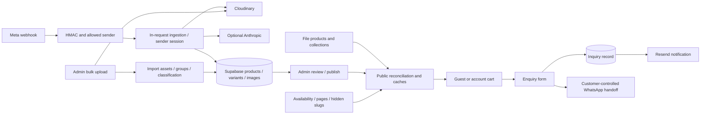

# 1. Executive verdict

**RED — unsafe for production reliance across the complete requested workflow.**

Audit date: 2026-10-04. Scope: the current working tree in `C:\dev\wcs-storefront`, including the user's existing uncommitted changes. This is an audit, not a repair. No application implementation, deployed service, production database, Cloudinary asset, Meta configuration, DNS, or Vercel deployment was changed. Disposable PostgreSQL data and local browser/test artifacts were created.

| Critical | High | Medium | Low | Total findings | Verified subsystems (scoped) | Unverified/environment-blocked subsystems |
| --- | --- | --- | --- | --- | --- | --- |
| 5 | 13 | 15 | 2 | 35 | 6 | 8 |

The feature matrix has 37 entries. The remaining 23 have issues, are broken, partially implemented or obsolete; they are not counted as verified. Counts refer to matrix rows, not complete business chains.

The most consequential demonstrated failures are migration replay restoring permissive access policies, lost batched WhatsApp messages, acknowledged ingestion failures without durable recovery, session consumption races, and JavaScript execution through the admin login redirect. Publication can fail open on a database read error. Saving the first homepage draft writes it to the public content column. These are independent of the production build failure.

There is meaningful working functionality: all 400 existing tests passed, the guest cart worked in Chrome, all checked committed media decoded, clean-schema customer isolation passed SQL role probes, and stock-history/undo/bulk rollback passed the repository's real SQL verification. These are scoped results, not evidence that the complete production system works.

**No complete external-service business chain was certified end to end.** Live Supabase Auth/PostgREST, Cloudinary, Meta, Anthropic, Resend, Redis, Sentry receipt, production deployment and restore configuration remain unverified. Production build and configured E2E were attempted and failed. The report separates reproduced behavior, mocked integration behavior, static analysis and environmental blockers throughout.

The requested Astra 6 / medium setting could not be switched or independently verified from inside this active session. No claim is made that the audit ran under that model setting. No subagents were used.

# 2. What I actually executed

## Evidence conventions and safety boundary

`REPRODUCED` means observed in a local command/browser/SQL execution; each entry identifies mocks. `STATIC ANALYSIS ONLY — NOT RUNTIME VERIFIED` means a source trace, not a production result. `UNVERIFIED — BLOCKED BY ENVIRONMENT` means the missing dependency and verification procedure are identified. A passing audit probe can **prove a defect exists** because the assertion deliberately encodes the observed bad behavior.

Evidence is retained under [reports/health-check](reports/health-check/), which is ignored by the existing `.gitignore`. The report contains the substantive results so it remains useful without those local files. To share reproducible probes/logs, explicitly include that directory separately; do not include its disposable `pgdata` or caches. No environment secret values are printed in this report.

## Verification commands

| Command / operation | Exit | Result and relevant output |
|---|---:|---|
| `git status --short`, repository/file inventory and `git diff` inspection | 0 | Recorded the existing six modified source files and untracked media; preserved them. Final verification below. |
| `node --version`; `npm --version` | 0 | Node `v24.15.0`, npm `11.12.1`; repository `.nvmrc` is `20`. |
| `npm ls --depth=0` | 0 | Installed dependencies available; extraneous `@img/sharp-wasm32@0.35.4`. No install/lockfile mutation needed for inspection. |
| `npm run check:env` | 1 | WhatsApp ingestion only partially configured. Local `WHATSAPP_APP_SECRET` and `WHATSAPP_ADMIN_NUMBERS` absent/empty; no credential values disclosed. `check-env.log`. |
| `npm run lint` | 0 | One ImportUploader ref-cleanup warning at line 203; Next lint/Sentry configuration deprecation notices. `check-0.log`. |
| `npm run types` | 0 | TypeScript no-emit completed. `check-1.log`. |
| `npm test -- --coverage` | 0 | **41 files, 400 tests passed**. Statements 66.08%, branches 56.14%, functions 69.9%, lines 68.87%. `check-2.log`, `coverage/`. |
| `npm audit --json` | 1 | Registry/network failure; no usable advisory result. `check-3.log`. |
| Escalated `npm audit --json --cache reports/health-check/npm-cache` | Not executed | Automatic approval review rejected sending dependency/project metadata to the external npm registry without specific authorization for that payload/destination. No alternate channel was used to bypass that rejection. |
| `docker info` | 1 | Docker engine unavailable; config access also denied. `check-4.log`. |
| `supabase status` | 1 | CLI failed writing telemetry under the user directory; no local Supabase stack established. `check-5.log`. |
| `npm run build` with sanitized backend environment | 3221226505 / signed -1073740791 | Compiled successfully, then Windows prerender worker crashed. **Build failed**, not a pass. `build.log`. |
| `npm run test:e2e` with `CI=1`, Sentry uploads disabled | 1 | Configured webServer's production build crashed with the same worker code; **no Playwright suite tests ran**. `e2e.log`. |
| `npm run dev -- --port 3107` with sanitized environment | Started | Local development server used for browser probes, not a production build. `dev.log`. |
| PostgreSQL 18 `initdb.exe -D .../reports/health-check/pgdata -U audit --auth=trust --encoding=UTF8 --locale=C` | 0 | Created a disposable local cluster. `initdb.log`. |
| PostgreSQL `pg_ctl ... start` | 1 | Windows restricted-token startup error 87; no server from this attempt. |
| `postgres.exe -D .../reports/health-check/pgdata -h 127.0.0.1 -p 55432` | Started | Direct local-only server startup succeeded; no live connection string used. |
| `node reports/health-check/database-probe.mjs` | 0 | Applied all 23 migrations, evaluated clean RLS/permissions, reproduced job constraint, evaluated numeric ledger mismatch. Expected SQL errors captured as findings. `database.log`, `database-results.json`. |
| `psql -h 127.0.0.1 -p 55432 -U audit -d postgres -v ON_ERROR_STOP=1 -f scripts/verify-availability.sql` | 0 | “Availability lifecycle, undo, bulk atomicity and permissions passed; fixtures rolled back.” `availability-sql.log`. |
| `node reports/health-check/database-failures.mjs` | 0 | Actual runner replay committed 001–007 then failed008; variants 7→14; pending B lost after reset; primary-image conflict23505. `database-failures.json`. |
| Initial one-line replay query / first replay-security probe | Failed query | PowerShell quoting error, then nonexistent `sender_phone` column in the first probe. Corrected to `admin_phone`; these failed attempts are not evidence of policy protection. |
| `node reports/health-check/replay-security.mjs` (corrected) | 0 | After replay, anon read/updated one upload session and authenticated role updated four products. `replay-security.json`. |
| `npx --no-install vitest run --config reports/health-check/audit.config.ts` | 0 | **3 files, 16 audit probes passed**, including reproduced negative behaviors, valid dedupe, path checks. `probes.log`. |
| `node reports/health-check/inventory.mjs` | 0 | Source inventory: 249 source files, 52 page/handler routes, 61 exported admin-module functions (60 privileged guards plus `toResult`). `inventory.json`. |
| `node reports/health-check/browser-probe.mjs` | 0 | 7 routes × 3 widths =21 successful page loads; no horizontal overflow or pageerror; one product page inspected. `browser-results.json`, `product-mobile.png`. |
| `node reports/health-check/browser-flow.mjs` | 0 | Add/increase/persist/cross-tab/remove; required-field focus; blocked-popup recovery; 500 inquiry still confirms. `browser-flow.json`, `enquiry-failure-mobile.png`. |
| `node reports/health-check/redirect-probe.mjs` | 0 | Harmless JavaScript marker executed through admin redirect; customer backslash path attempted external navigation. Auth responses mocked, external destinations intercepted. `redirect-results.json`. |
| `node scripts/score-media.mjs --report` | 0 | Read-only scoring/decoding ran; no source media overwritten. `media-score.log`. |
| Exact-case catalogue path probe in `media.test.ts` | 0 | 24 file products; 182 image/video/poster references; zero missing paths; zero dangling collection product slugs. `media-path-results.json`. |
| `node reports/health-check/media-metadata.mjs` | 0 | Sharp metadata for173 images; ffprobe for14 videos; no errors, no EXIF/orientation flags; H.264/AAC streams. `media-metadata.json`. |
| `npx --no-install lighthouse http://127.0.0.1:3107 --only-categories=performance,accessibility,best-practices,seo --output=json --output-path=reports/health-check/lighthouse.json --quiet --chrome-flags="--headless"` | 1 | Failed fetching Chrome debugger WebSocket URL; **no Lighthouse scores**. `lighthouse.log`. |

Routine read-only inspection used `rg --files`, `rg -n`, `Get-Content`, `Get-ChildItem`, JSON parsing and AST/lockfile inspection across the request attachment, repository instructions, all migrations, routes/action modules, components/providers, tests, scripts, config and listed documentation. Several exploratory reads failed because `PROJECT_AUDIT.md` is under `docs/`, components/providers have different paths, or PowerShell wildcard strings were passed as literal paths (`docs/*.md`, `src/app/admin/*actions.ts`, `src/lib/cart/*`, `sentry*`). Searches were corrected with actual paths and `rg -g`. No conclusions rely on those failed reads. The raw GitHub source lookup for a Supabase migration parser returned404; official CLI documentation supplied the version-format corroboration instead.

**Sanitized execution:** Supabase URL pointed at `127.0.0.1:54321` with dummy keys; Redis at local port8079; database URL and external AI/email/Meta/Sentry/analytics tokens were cleared for the dev/build probes. Browser probes blocked non-local external requests. The redirect probe used dummy successful Auth responses, not real accounts. SQL probes hardcoded loopback55432 and user `audit`; the service role/`auth.uid()` were emulated locally. PostgreSQL18.3 is not the repository's configured PostgreSQL15, and this did not start PostgREST/GoTrue. Those differences bound the conclusions.

**Other scripts inspected but not executed destructively:** `prepare-media.mjs`, `optimize-video.mjs`, `prepare-logo.mjs` and `extract-colour-variants.mjs` write source assets/data; `indexnow.mjs` sends a real search-engine request; `run-migrations.mjs` can mutate the configured database. Their source was reviewed, but running them against user assets/live services was unnecessary for an audit. The runner's actual shared implementation was executed only against disposable data. `npm start` cannot validate a release until a complete build exists; `npm install`/`npm ci` were not run because existing installed state was sufficient and network/install mutations were not needed. CI's Linux CodeQL job was inspected, not locally executed.

## Report assembly and cleanup

`node reports/health-check/generate-report.mjs` assembled the report and inventories successfully. Final `git status --short` showed the same six pre-existing modified source files and pre-existing untracked JPEG, plus the new report; no application fixes were made. Git emitted user-level ignore-file permission warnings. A process inspection via CIM was denied; it was not used as evidence that servers had stopped. The audit PostgreSQL instance was positively identified by its exact `reports/health-check/pgdata` directory and stopped with `pg_ctl stop -m fast` (exit0, “server stopped”). The audit dev-server session was interrupted. Other system PostgreSQL/Node processes were left alone. An initial report-write attempt was not executed because automatic approval review hit a usage limit; work resumed on the user's explicit continuation. A documentation patch with an incomplete line match failed harmlessly and was reapplied with a matching context.

# 3. Architecture discovered

## Current versions and source ownership

The installed/locked application is **Next15.5.25 App Router, React/React DOM19.2.8, TypeScript5.9.3**, Supabase JS2.108.2, Sentry10.73.0, Vitest4.1.11, Playwright1.62.1, sharp0.35.4 and Resend4.8.0. The manifest uses several ranges; these are observed installed versions, not claims about future releases. The latest migration is **023_catalog_query_indexes.sql**, with no numbering gaps001–023.

There is no payment checkout, order fulfillment engine or stock reservation. Conversion is an enquiry basket and WhatsApp handoff. Public products are a hybrid: curated `src/data/products.ts`/local media, published database materialization, selected file_sync overrides, hidden-slug state, retirement rules, and availability overrides. Collections use a different, file-led overlay algorithm. Customer identity uses Supabase Auth and browser providers; only carts/profiles are directly customer-writable. Admin uses server-side allowlisted email checks and a server-only service-role client.



The arrows represent actual dependencies, **not one atomic transaction**. There is no durable background worker/scheduler for ingestion. Import processing jobs are database records used by request/action work, not an independently running queue. Cart writes are browser-debounced600ms. Next cached reads revalidate after60s plus action tags; sitemap revalidates3600s. CI CodeQL runs weekly; no application cron recovery worker was found.

## Complete page/handler route inventory

The following52 entries come from actual App Router files. Metadata endpoints `/sitemap.xml`, `/robots.txt`, `/manifest.webmanifest` and framework-discovered icons/social assets are additional. Public route rendering is only browser-verified for the subset in section2; dynamic/admin/auth routes are mapped but not assumed working.

| Route | Kind | Source file | Access boundary |
| --- | --- | --- | --- |
| /about | page | src/app/(public)/about/page.tsx | Public/customer route |
| /account | page | src/app/(public)/account/page.tsx | Public/customer route |
| /cart | page | src/app/(public)/cart/page.tsx | Public/customer route |
| /catalog | page | src/app/(public)/catalog/page.tsx | Public/customer route |
| /catalog/[category] | page | src/app/(public)/catalog/[category]/page.tsx | Public/customer route |
| /collections | page | src/app/(public)/collections/page.tsx | Public/customer route |
| /collections/[slug] | page | src/app/(public)/collections/[slug]/page.tsx | Public/customer route |
| /contact | page | src/app/(public)/contact/page.tsx | Public/customer route |
| /enquiry | page | src/app/(public)/enquiry/page.tsx | Public/customer route |
| /enquiry/sent | page | src/app/(public)/enquiry/sent/page.tsx | Public/customer route |
| /forgot-password | page | src/app/(public)/forgot-password/page.tsx | Public/customer route |
| /guides | page | src/app/(public)/guides/page.tsx | Public/customer route |
| /guides/[slug] | page | src/app/(public)/guides/[slug]/page.tsx | Public/customer route |
| /(public) | page | src/app/(public)/page.tsx | Public/customer route |
| /privacy | page | src/app/(public)/privacy/page.tsx | Public/customer route |
| /reset-password | page | src/app/(public)/reset-password/page.tsx | Public/customer route |
| /sarees/[slug] | page | src/app/(public)/sarees/[slug]/page.tsx | Public/customer route |
| /search | page | src/app/(public)/search/page.tsx | Public/customer route |
| /shipping-returns | page | src/app/(public)/shipping-returns/page.tsx | Public/customer route |
| /signin | page | src/app/(public)/signin/page.tsx | Public/customer route |
| /signup | page | src/app/(public)/signup/page.tsx | Public/customer route |
| /terms | page | src/app/(public)/terms/page.tsx | Public/customer route |
| /admin/categories/new | page | src/app/admin/(dashboard)/categories/new/page.tsx | Dashboard layout/admin guard |
| /admin/categories | page | src/app/admin/(dashboard)/categories/page.tsx | Dashboard layout/admin guard |
| /admin/categories/[id] | page | src/app/admin/(dashboard)/categories/[id]/page.tsx | Dashboard layout/admin guard |
| /admin/collections/new | page | src/app/admin/(dashboard)/collections/new/page.tsx | Dashboard layout/admin guard |
| /admin/collections | page | src/app/admin/(dashboard)/collections/page.tsx | Dashboard layout/admin guard |
| /admin/collections/[id] | page | src/app/admin/(dashboard)/collections/[id]/page.tsx | Dashboard layout/admin guard |
| /admin/contacts/new | page | src/app/admin/(dashboard)/contacts/new/page.tsx | Dashboard layout/admin guard |
| /admin/contacts | page | src/app/admin/(dashboard)/contacts/page.tsx | Dashboard layout/admin guard |
| /admin/contacts/[id] | page | src/app/admin/(dashboard)/contacts/[id]/page.tsx | Dashboard layout/admin guard |
| /admin/database | page | src/app/admin/(dashboard)/database/page.tsx | Dashboard layout/admin guard |
| /admin/import/new | page | src/app/admin/(dashboard)/import/new/page.tsx | Dashboard layout/admin guard |
| /admin/import | page | src/app/admin/(dashboard)/import/page.tsx | Dashboard layout/admin guard |
| /admin/import/[batchId] | page | src/app/admin/(dashboard)/import/[batchId]/page.tsx | Dashboard layout/admin guard |
| /admin/inquiries | page | src/app/admin/(dashboard)/inquiries/page.tsx | Dashboard layout/admin guard |
| /admin/(dashboard) | page | src/app/admin/(dashboard)/page.tsx | Dashboard layout/admin guard |
| /admin/pages | page | src/app/admin/(dashboard)/pages/page.tsx | Dashboard layout/admin guard |
| /admin/products/new | page | src/app/admin/(dashboard)/products/new/page.tsx | Dashboard layout/admin guard |
| /admin/products | page | src/app/admin/(dashboard)/products/page.tsx | Dashboard layout/admin guard |
| /admin/products/[id] | page | src/app/admin/(dashboard)/products/[id]/page.tsx | Dashboard layout/admin guard |
| /admin/storefront-availability | page | src/app/admin/(dashboard)/storefront-availability/page.tsx | Dashboard layout/admin guard |
| /admin/subscribers | page | src/app/admin/(dashboard)/subscribers/page.tsx | Dashboard layout/admin guard |
| /admin/login | page | src/app/admin/login/page.tsx | Public login; F24 |
| /api/import/complete | handler | src/app/api/import/complete/route.ts | See API matrix section9 |
| /api/import/sign | handler | src/app/api/import/sign/route.ts | See API matrix section9 |
| /api/inquiries | handler | src/app/api/inquiries/route.ts | See API matrix section9 |
| /api/subscribe | handler | src/app/api/subscribe/route.ts | See API matrix section9 |
| /api/upload | handler | src/app/api/upload/route.ts | See API matrix section9 |
| /api/whatsapp | handler | src/app/api/whatsapp/route.ts | See API matrix section9 |
| /auth/callback | handler | src/app/auth/callback/route.ts | Auth code handler |
| /[key] | handler | src/app/[key]/route.ts | Public/customer route |

## Providers, security and cache boundaries

Public layout composes AuthProvider, CartProvider, source tracking and shared header/footer; AuthContext hydrates/observes Supabase sessions. CartProvider persists `wcs.cart.v2`, migrates v1, uses owner/timestamp-aware reconciliation and a Supabase cart row. Profile hook supplies saved enquiry details. Product/carousel/dialog and content-editing components add their own client state; they are not separate data stores.

Middleware refreshes/verifies Supabase auth for `/admin`; an authenticated customer is not an admin merely by passing middleware. Dashboard layout and privileged operations call `requireAdmin`/`assertAdmin`, which validates `ADMIN_EMAILS` and caches repeated checks within the request. `/api/upload`, `/api/import/sign`, `/api/import/complete` independently check user and allowlist. Public inquiry/subscription routes use validated server-side service-role writes; that is an intentional exception to the documentation's “only after admin check” shorthand. WhatsApp has its own HMAC/sender boundary. The service-role key is not a NEXT_PUBLIC variable and browser-client source imports use the anon key; no browser key exposure was found by source tracing. A production bundle/secret scan remains unverified because the build did not finish.

Cache tags: `storefront-media` (published rows/hidden slugs), `storefront-availability`, `storefront-collections`, `storefront-pages`. Admin mutations revalidate relevant tags/paths with exceptions detailed in section8. Browser local/session storage and Next image caches are additional layers; an already-open client may remain stale until reload.

## Server action inventory

Every exported privileged admin action found has an independent guard; `toResult` is the unguarded utility wrapper, not an independently safe mutation API. The automated inventory's schema/cache markers are heuristic indicators and **not validation-completeness assertions**; F11/F12 show why a guard/schema marker is insufficient. Most actions have no rate limiter; expensive enrichment/migration actions therefore rely on authenticated access and platform limits.

| Function | File:line | Auth | Input marker | Cache calls (static) | Test references |
| --- | --- | --- | --- | --- | --- |
| toResult | src/app/admin/actions.ts:55 | Utility wrapper | No schema marker in function body | No direct revalidation marker | No direct name reference in existing tests |
| listContacts | src/app/admin/actions.ts:256 | Independent guard | Marker present; inspect completeness | No direct revalidation marker | 1 test-file references (not execution proof) |
| saveContact | src/app/admin/actions.ts:263 | Independent guard | Marker present; inspect completeness | revalidatePath("/admin/contacts") | 1 test-file references (not execution proof) |
| deleteContact | src/app/admin/actions.ts:306 | Independent guard | No schema marker in function body | revalidatePath("/admin/contacts") | 1 test-file references (not execution proof) |
| saveCategory | src/app/admin/actions.ts:316 | Independent guard | Marker present; inspect completeness | revalidatePath(`/catalog/${previousSlug}`); revalidatePath("/"); revalidatePath("/catalog"); revalidatePath("/admin/categories"); revalidatePath(`/catalog/${slug}`); revalidateCatalogShell() | No direct name reference in existing tests |
| deleteCategory | src/app/admin/actions.ts:365 | Independent guard | No schema marker in function body | revalidatePath(`/catalog/${slug}`); revalidatePath("/"); revalidatePath("/catalog"); revalidatePath("/admin/categories"); revalidateCatalogShell() | No direct name reference in existing tests |
| exportContactsCsv | src/app/admin/actions.ts:391 | Independent guard | Marker present; inspect completeness | No direct revalidation marker | 1 test-file references (not execution proof) |
| importContactsCsv | src/app/admin/actions.ts:430 | Independent guard | Marker present; inspect completeness | revalidatePath("/admin/contacts") | No direct name reference in existing tests |
| saveProduct | src/app/admin/actions.ts:523 | Independent guard | Marker present; inspect completeness | revalidatePath(`/sarees/${previousSlug}`); revalidatePublic(slug); revalidateCatalogShell() | 3 test-file references (not execution proof) |
| duplicateProduct | src/app/admin/actions.ts:717 | Independent guard | No schema marker in function body | revalidatePublic(slugify(source.slug)); revalidateCatalogShell() | No direct name reference in existing tests |
| updateProductDetails | src/app/admin/actions.ts:803 | Independent guard | Marker present; inspect completeness | revalidatePublic(current.slug as string); revalidateCatalogShell(); revalidatePath(`/admin/products/${id}`) | 1 test-file references (not execution proof) |
| updateProductStatus | src/app/admin/actions.ts:832 | Independent guard | Marker present; inspect completeness | revalidatePublic(data.slug as string); revalidatePath("/admin/products") | 1 test-file references (not execution proof) |
| toggleFeatured | src/app/admin/actions.ts:849 | Independent guard | No schema marker in function body | revalidatePublic(data.slug as string); revalidateCatalogShell() | No direct name reference in existing tests |
| deleteProduct | src/app/admin/actions.ts:865 | Independent guard | No schema marker in function body | revalidatePublic(data.slug as string); revalidateCatalogShell() | No direct name reference in existing tests |
| saveCollection | src/app/admin/actions.ts:881 | Independent guard | Marker present; inspect completeness | revalidatePath(`/collections/${previousSlug}`); revalidateCatalogShell(); revalidatePath(`/collections/${slug}`) | No direct name reference in existing tests |
| reorderCollectionProducts | src/app/admin/actions.ts:939 | Independent guard | No schema marker in function body | revalidatePath(`/collections/${slug}`); revalidateTag("storefront-collections"); revalidateCatalogShell() | No direct name reference in existing tests |
| getPendingMigrations | src/app/admin/db-migrations-actions.ts:77 | Independent guard | No schema marker in function body | No direct revalidation marker | No direct name reference in existing tests |
| applyPendingMigrations | src/app/admin/db-migrations-actions.ts:100 | Independent guard | No schema marker in function body | No direct revalidation marker | No direct name reference in existing tests |
| listEnrichmentCandidates | src/app/admin/enrichment-actions.ts:165 | Independent guard | No schema marker in function body | No direct revalidation marker | No direct name reference in existing tests |
| previewProductEnrichment | src/app/admin/enrichment-actions.ts:211 | Independent guard | Marker present; inspect completeness | No direct revalidation marker | No direct name reference in existing tests |
| applyProductEnrichment | src/app/admin/enrichment-actions.ts:294 | Independent guard | Marker present; inspect completeness | revalidatePath(`/sarees/${slug}`); revalidateTag("storefront-media"); revalidateTag("storefront-collections"); revalidatePath("/admin/products"); revalidatePath("/search"); revalidatePath("/catalog"); revalidatePath("/catalog/[category]", "page"); revalidatePath("/collections/[slug]", "page"); revalidatePath("/") | No direct name reference in existing tests |
| listIdentifierCandidates | src/app/admin/enrichment-actions.ts:454 | Independent guard | No schema marker in function body | No direct revalidation marker | No direct name reference in existing tests |
| previewProductIdentifiers | src/app/admin/enrichment-actions.ts:510 | Independent guard | Marker present; inspect completeness | No direct revalidation marker | No direct name reference in existing tests |
| applyProductIdentifiers | src/app/admin/enrichment-actions.ts:528 | Independent guard | Marker present; inspect completeness | revalidatePath(`/sarees/${proposal.current_slug}`); revalidatePath(`/sarees/${proposal.slug}`); revalidatePath("/admin/products"); revalidateTag("storefront-availability"); revalidateTag("storefront-media"); revalidatePath("/admin/storefront-availability"); revalidatePath("/catalog"); revalidatePath("/search"); revalidatePath("/") | No direct name reference in existing tests |
| listColorSplitCandidates | src/app/admin/enrichment-actions.ts:631 | Independent guard | No schema marker in function body | No direct revalidation marker | No direct name reference in existing tests |
| previewColorSplit | src/app/admin/enrichment-actions.ts:660 | Independent guard | Marker present; inspect completeness | No direct revalidation marker | No direct name reference in existing tests |
| applyColorSplit | src/app/admin/enrichment-actions.ts:736 | Independent guard | Marker present; inspect completeness | revalidatePath(`/sarees/${row.slug}`); revalidateTag("storefront-media"); revalidatePath("/admin/products") | No direct name reference in existing tests |
| createImportBatch | src/app/admin/import-actions.ts:39 | Independent guard | Marker present; inspect completeness | revalidateImport() | No direct name reference in existing tests |
| cancelImportBatch | src/app/admin/import-actions.ts:63 | Independent guard | No schema marker in function body | revalidateImport(batchId) | No direct name reference in existing tests |
| completeImportBatch | src/app/admin/import-actions.ts:73 | Independent guard | No schema marker in function body | revalidateImport(batchId) | No direct name reference in existing tests |
| autoGroupBatchAssets | src/app/admin/import-actions.ts:103 | Independent guard | No schema marker in function body | revalidateImport(batchId); revalidateImport(batchId) | No direct name reference in existing tests |
| classifyAllGroups | src/app/admin/import-actions.ts:180 | Independent guard | No schema marker in function body | revalidateImport(batchId) | No direct name reference in existing tests |
| deleteImportGroup | src/app/admin/import-actions.ts:212 | Independent guard | No schema marker in function body | revalidateImport((group as { batch_id: string }).batch_id) | 1 test-file references (not execution proof) |
| deleteImportAsset | src/app/admin/import-actions.ts:238 | Independent guard | No schema marker in function body | revalidateImport((asset as { batch_id: string }).batch_id) | 1 test-file references (not execution proof) |
| deleteImportedDraftProduct | src/app/admin/import-actions.ts:263 | Independent guard | No schema marker in function body | revalidatePath("/admin/products"); revalidateImport((group as { batch_id: string }).batch_id) | 1 test-file references (not execution proof) |
| mergeImportGroups | src/app/admin/import-actions.ts:293 | Independent guard | Marker present; inspect completeness | revalidateImport((targetGroup as { batch_id: string }).batch_id) | No direct name reference in existing tests |
| splitImportGroup | src/app/admin/import-actions.ts:353 | Independent guard | Marker present; inspect completeness | revalidateImport(batchId) | No direct name reference in existing tests |
| moveImportAsset | src/app/admin/import-actions.ts:403 | Independent guard | Marker present; inspect completeness | revalidateImport((asset as { batch_id: string }).batch_id) | No direct name reference in existing tests |
| reorderImportGroupAssets | src/app/admin/import-actions.ts:438 | Independent guard | Marker present; inspect completeness | No direct revalidation marker | No direct name reference in existing tests |
| setImportGroupPrimaryAsset | src/app/admin/import-actions.ts:460 | Independent guard | Marker present; inspect completeness | No direct revalidation marker | No direct name reference in existing tests |
| updateImportGroupDescription | src/app/admin/import-actions.ts:483 | Independent guard | Marker present; inspect completeness | No direct revalidation marker | No direct name reference in existing tests |
| requestGroupAiSuggestions | src/app/admin/import-actions.ts:554 | Independent guard | No schema marker in function body | revalidateImport(group.batch_id) | No direct name reference in existing tests |
| requestGroupColorVariantSuggestions | src/app/admin/import-actions.ts:598 | Independent guard | No schema marker in function body | revalidateImport(group.batch_id) | No direct name reference in existing tests |
| applyGroupColorVariants | src/app/admin/import-actions.ts:643 | Independent guard | No schema marker in function body | revalidateImport(group.batch_id) | No direct name reference in existing tests |
| clearGroupColorVariants | src/app/admin/import-actions.ts:673 | Independent guard | No schema marker in function body | revalidateImport(group.batch_id) | No direct name reference in existing tests |
| requestGroupCollectionClassification | src/app/admin/import-actions.ts:739 | Independent guard | No schema marker in function body | revalidateImport(group.batch_id) | No direct name reference in existing tests |
| confirmGroupCollection | src/app/admin/import-actions.ts:810 | Independent guard | Marker present; inspect completeness | No direct revalidation marker | No direct name reference in existing tests |
| addCollectionAlias | src/app/admin/import-actions.ts:854 | Independent guard | Marker present; inspect completeness | No direct revalidation marker | No direct name reference in existing tests |
| removeCollectionAlias | src/app/admin/import-actions.ts:867 | Independent guard | No schema marker in function body | No direct revalidation marker | No direct name reference in existing tests |
| createProductFromGroup | src/app/admin/import-actions.ts:903 | Independent guard | No schema marker in function body | revalidateImport(group.batch_id); revalidatePath("/admin/products") | 1 test-file references (not execution proof) |
| approveImportedProductReview | src/app/admin/import-actions.ts:1101 | Independent guard | No schema marker in function body | revalidatePath("/admin/products") | No direct name reference in existing tests |
| savePageDraft | src/app/admin/page-content-actions.ts:27 | Independent guard | No schema marker in function body | revalidatePath("/admin/pages") | 1 test-file references (not execution proof) |
| publishPageContent | src/app/admin/page-content-actions.ts:48 | Independent guard | No schema marker in function body | revalidatePublic() | 1 test-file references (not execution proof) |
| restorePageVersion | src/app/admin/page-content-actions.ts:66 | Independent guard | Marker present; inspect completeness | revalidatePublic() | 1 test-file references (not execution proof) |
| setStorefrontAvailability | src/app/admin/storefront-availability-actions.ts:48 | Independent guard | Marker present; inspect completeness | No direct revalidation marker | 1 test-file references (not execution proof) |
| clearStorefrontAvailability | src/app/admin/storefront-availability-actions.ts:56 | Independent guard | Marker present; inspect completeness | No direct revalidation marker | 1 test-file references (not execution proof) |
| bulkStorefrontAvailability | src/app/admin/storefront-availability-actions.ts:63 | Independent guard | Marker present; inspect completeness | No direct revalidation marker | 1 test-file references (not execution proof) |
| getSignalHistory | src/app/admin/storefront-availability-actions.ts:74 | Independent guard | Marker present; inspect completeness | No direct revalidation marker | 1 test-file references (not execution proof) |
| undoSignalChanges | src/app/admin/storefront-availability-actions.ts:86 | Independent guard | Marker present; inspect completeness | No direct revalidation marker | 1 test-file references (not execution proof) |
| syncFileProducts | src/app/admin/sync-actions.ts:292 | Independent guard | No schema marker in function body | revalidateTag("storefront-media"); revalidateTag("storefront-collections"); revalidatePath("/admin/products"); revalidatePath("/admin/collections"); revalidatePath("/admin/categories") | 1 test-file references (not execution proof) |
| detectVariantColor | src/app/admin/variant-color-actions.ts:33 | Independent guard | No schema marker in function body | No direct revalidation marker | 1 test-file references (not execution proof) |

## Environment and operational configuration inventory

The following names were found in source/scripts/configuration; values were not copied. Supabase URL/anon key and public identifiers are intentionally browser-visible. Service-role, DATABASE_URL, Cloudinary secret, Meta access/app secret, Anthropic, Redis, Resend and Sentry auth token are server/build secrets. `WHATSAPP_VERIFY_TOKEN` is dynamically accessed and therefore supplemented manually to the AST inventory.

`ADMIN_EMAILS`, `ANTHROPIC_API_KEY`, `ANTHROPIC_COLOUR_MODEL`, `ANTHROPIC_IMPORT_MODEL`, `BING_SITE_VERIFICATION`, `CI`, `CLOUDINARY_API_KEY`, `CLOUDINARY_API_SECRET`, `CLOUDINARY_CLOUD_NAME`, `CLOUDINARY_UPLOAD_FOLDER`, `DATABASE_CA_CERT`, `DATABASE_URL`, `E2E_TESTING`, `GOOGLE_SITE_VERIFICATION`, `INDEXNOW_KEY`, `INQUIRY_NOTIFICATION_EMAIL`, `LOCAL_SERVICE_ROLE_KEY`, `NEXT_PUBLIC_BUSINESS_NAME`, `NEXT_PUBLIC_CLARITY_PROJECT_ID`, `NEXT_PUBLIC_CLOUDINARY_CLOUD_NAME`, `NEXT_PUBLIC_CONTACT_EMAIL`, `NEXT_PUBLIC_GA_MEASUREMENT_ID`, `NEXT_PUBLIC_GOOGLE_AUTH_ENABLED`, `NEXT_PUBLIC_GSTIN`, `NEXT_PUBLIC_INSTAGRAM_URL`, `NEXT_PUBLIC_PINTEREST_TAG_ID`, `NEXT_PUBLIC_SENTRY_DSN`, `NEXT_PUBLIC_SITE_URL`, `NEXT_PUBLIC_SUPABASE_ANON_KEY`, `NEXT_PUBLIC_SUPABASE_URL`, `NEXT_PUBLIC_WHATSAPP_NUMBER`, `NEXT_RUNTIME`, `NEXT_TELEMETRY_DISABLED`, `NODE_ENV`, `RESEND_API_KEY`, `RESEND_FROM_EMAIL`, `SENTRY_AUTH_TOKEN`, `SENTRY_ORG`, `SENTRY_PROJECT`, `SUPABASE_SERVICE_ROLE_KEY`, `UPSTASH_REDIS_REST_TOKEN`, `UPSTASH_REDIS_REST_URL`, `WHATSAPP_ACCESS_TOKEN`, `WHATSAPP_ADMIN_NUMBERS`, `WHATSAPP_APP_SECRET`, `WHATSAPP_PHONE_NUMBER_ID`, `WHATSAPP_VERIFY_TOKEN`

`check-env` checks selected required values/URL/phone shape and all-or-none ingestion configuration; it does not prove credential validity, provider access, migrations, sender authorization, redirect allowlists or alert receipt. It is not called by the main CI workflow. `.env.local` has partial ingestion configuration, so local WhatsApp success is explicitly blocked.

CI consists of `ci.yml` (npm ci, production high/critical dependency audit, lint, types, coverage, build), `e2e.yml` (local Supabase reset, test-user seed, Chrome, production Playwright), and `codeql.yml` (JS/TS security-and-quality, weekly schedule). CI uses Node from `.nvmrc`; Supabase CLI version is `latest`, which is not reproducibly pinned. Vercel deployment is documented; branch protection, required checks, production environment separation, preview credentials, deployment history and rollback settings are not accessible and are **UNVERIFIED — BLOCKED BY ENVIRONMENT**.

# 4. Feature health matrix

Statuses are scoped to the evidence column. “Verified working” never means a live integration was tested when it was not. Mixed implementations receive an issues/broken status even when some internal tests pass.

| Subsystem | Status | Evidence | Main issue | Confidence |
| --- | --- | --- | --- | --- |
| Webhook cryptographic verification | ✅ VERIFIED WORKING | 400-test suite; HMAC/raw-body implementation | Local tests only; actual Meta delivery blocked | High locally |
| WhatsApp envelope/batch handling | ❌ BROKEN | F02/F06 probes | Only first message processed | High |
| WhatsApp durable creation/retry | ❌ BROKEN | F03/F04 fault/SQL probes | Partial writes, races, 200 on loss | High |
| Meta media/reply delivery | 🔵 UNVERIFIED / ENVIRONMENT BLOCKED | No live Meta call | F05; no authorized test sender/configured local secrets | High about blocker |
| AI schema/fallback/style rules | ⚠️ WORKING WITH ISSUES | Unit suite; F07 source trace | Semantic grounding weaker than claim | Medium |
| Live Anthropic quality/latency | 🔵 UNVERIFIED / ENVIRONMENT BLOCKED | No live AI requests | Provider quality and real timeouts not exercised | High about blocker |
| Bulk import upload registration | ❌ BROKEN | F09 route probe | Completion bypass and retry gaps | High |
| Import grouping/classification logic | ⚠️ WORKING WITH ISSUES | Unit tests; source trace | Heuristic only; full service flow blocked | Medium |
| Visual similarity grouping | 🟠 PARTIALLY IMPLEMENTED | Docs explicitly exclude it | No visual embedding/grouping implementation | High |
| Import colour job persistence | ❌ BROKEN | F08 actual SQL | Surviving older check constraint | High |
| Import create/review/publish | ❌ BROKEN | F10/F11 | Fail-open publish read, non-atomic creation | High on gate |
| Product/variant/collection CRUD | ⚠️ WORKING WITH ISSUES | Source, unit tests, F12/F13 | Destructive multi-step saves | Medium |
| File sync/reconciliation | ⚠️ WORKING WITH ISSUES | Merge probes; F17/F18/F35 | Deletion resurrection and incomplete retry repair | High on merge |
| Collection public controls | ❌ BROKEN | F16 probe and RLS | New/inactive collections mismatch | High |
| Guest cart local operations | ✅ VERIFIED WORKING | Real browser add/increase/refresh/cross-tab/remove | Scope excludes server sync | High |
| Cart merge pure rules | ✅ VERIFIED WORKING | cart-reconcile unit tests | Scope excludes AuthContext integration | High locally |
| Authenticated cart transitions | ⚠️ WORKING WITH ISSUES | F22/F23 source trace | Previous-owner display and best-effort saves | Medium |
| Enquiry conversion/delivery state | ❌ BROKEN | F19/F20 browser and probes | 500 still confirms; message omits references | High |
| Email notification delivery | ❌ BROKEN | F21 route fault probe | Resolved SDK error ignored; live delivery blocked | High on error |
| Admin authorization coverage | ⚠️ WORKING WITH ISSUES | 60 privileged exports guarded; route checks | Real session expiry/direct invocation blocked; F24 redirect | High static |
| Login redirect boundary | ❌ BROKEN | F24 real browser/mock auth | JavaScript sink and external navigation | High |
| Customer signup/OAuth/reset | 🔵 UNVERIFIED / ENVIRONMENT BLOCKED | Source reviewed; forms render | No local Auth server/email provider; signup locally disabled | High about blocker |
| Clean-schema customer RLS isolation | ✅ VERIFIED WORKING | Real PostgreSQL roles A/B/anon/service | Emulated auth.uid; not live PostgREST or PG15 | High locally |
| Migration deployment safety | ❌ BROKEN | F01 actual runner | Replay restores insecure policies | High |
| Availability RPC/history/lifecycle | ✅ VERIFIED WORKING | verify-availability.sql; role/rollback probes | Only SQL core; deployed UI and auth not proven | High locally |
| Availability public fail-soft | ⚠️ WORKING WITH ISSUES | Tests/source; offline browser | On-request fallback safe; stale cached signals possible | Medium |
| Website editor draft/version lifecycle | ❌ BROKEN | F14/F15 probes | First draft leaks; history errors ignored | High |
| CRM contacts/inquiries/subscribers | ⚠️ WORKING WITH ISSUES | Source, validators, RLS | CSV/phone/row-limit gaps; UI writes blocked | Medium |
| Committed media integrity | ✅ VERIFIED WORKING | 182 references; 173 images/14 videos inspected | Scope excludes visual appropriateness of every poster | High |
| Cloudinary live pipeline | 🔵 UNVERIFIED / ENVIRONMENT BLOCKED | Signed-upload code/probes only | No real upload/delete/restore performed | High about blocker |
| Redis rate limiting | ⚠️ WORKING WITH ISSUES | SDK/source F25 | Timeout policy and upload budget | Medium |
| Sentry/analytics live receipt | 🔵 UNVERIFIED / ENVIRONMENT BLOCKED | Configuration/source only | No synthetic receipt verified | High about blocker |
| Build/release acceptance | 🔵 UNVERIFIED / ENVIRONMENT BLOCKED | Build/E2E attempted and failed | Windows prerender crash; no production artifact | High about failure |
| Public responsive rendering | ⚠️ WORKING WITH ISSUES | 21 loads; no overflow/page errors | Dev fallback only; broader a11y/SEO unverified | High locally |
| Security dependency advisories | 🔵 UNVERIFIED / ENVIRONMENT BLOCKED | Audit network failure/rejected escalation | No vulnerability results | High about blocker |
| Backup/restore readiness | 🔵 UNVERIFIED / ENVIRONMENT BLOCKED | Runbook/source review | No provider backup settings or restore drill | High about blocker |
| Legacy catalogue chain | ⚫ DEAD / UNUSED / OBSOLETE | Reference search F33 | Apparently unused; confirm before removal | Medium |

# 5. Critical findings

All35 findings are listed here, including High/Medium/Low findings as requested. Counts are by finding ID, not by every individual symptom. “Impact” distinguishes business/data/security effects; where no separate security impact is shown, none was established. The recommended fixes/tests are proposals only; no implementation changes were made.

## F01 — Migration runner restores insecure policies and duplicates seed data

**Severity:** CRITICAL · **Subsystem:** Database / deployment

**Files / functions / relevant lines:** src/lib/db-migrations.mjs:82 (listMigrationFiles), :103 (listPendingMigrations), :136 (applyMigrations); supabase/migrations/001_schema.sql, 003_seed_sample_data.sql, 006_admin_upload_sessions.sql, 007_whatsapp_ingest_events.sql, 008_harden_public_policies.sql, 020_scope_admin_policies_and_enable_rls.sql

**Expected behavior:** Applying outstanding migrations must recognize already applied CLI migrations and retain hardened access.

**Actual behavior:** The runner uses the entire filename stem as version (001_schema), whereas a numeric migration ledger records 001. All 23 were considered pending. The actual runner committed 001–007, doubled variants from 7 to 14, then failed at an existing policy in 008. Earlier permissive policies remained committed: anon SELECT/UPDATE of admin_upload_sessions and authenticated UPDATE of four products succeeded. A manually initialized database without a populated ledger has the same replay risk. Concurrent invocations also have no advisory migration lock.

**How verified:** REPRODUCED on disposable PostgreSQL 18.3; database-failures.json and replay-security.json. The live ledger was not inspected. CLI version semantics are documented at https://supabase.com/docs/reference/cli/supabase-migration-list (numeric timestamps are compared).

**Reproduction:** Initialize the disposable schema through 023; populate schema_migrations with numeric prefixes; invoke the real applyMigrations; query policies and attempt writes using SET ROLE anon/authenticated. Do not reproduce on a shared database.

**Business / data-integrity / security impact:** One-click migration can expose customer/operational data and unauthorized catalogue writes. Data: duplicate seeds and a partly replayed schema. Security: demonstrated privilege regression, conditional on this deployment path.

**Recommended fix:** Disable the unsafe apply path until ledger reconciliation, schema preflight, numeric version compatibility, advisory locking, and seed exclusion are implemented. Prepare a separately reviewed corrective migration for any affected deployment; do not blindly replay old files.

**Recommended regression test:** Run migrations on pristine, CLI-managed, manual-ledger, partially applied, and concurrent-runner databases; assert data counts and all role permissions after success AND interrupted failure.

## F02 — Batched Meta messages are silently discarded

**Severity:** CRITICAL · **Subsystem:** WhatsApp

**Files / functions / relevant lines:** src/app/api/whatsapp/route.ts:214 (extractFirstMessage), :793 (POST)

**Expected behavior:** Every message in every entry/change must be accounted for before acknowledging a delivery.

**Actual behavior:** Only entry[0].changes[0].value.messages[0] is extracted. A payload containing three messages processes one and acknowledges the whole payload with HTTP 200.

**How verified:** REPRODUCED by audit.test.ts against the actual route with mocked downstream services; three-message payload yielded one processed event.

**Reproduction:** Run the audit Vitest config; inspect the batched-payload probe. Expand it to multiple entries and changes before remediation.

**Business / data-integrity / security impact:** Admin photos/descriptions can disappear without a retry. Data: permanently missing assets/products. Security: not an authorization bypass.

**Recommended fix:** Validate and enumerate the entire envelope; durably register each message ID before acknowledgement and process every item independently.

**Recommended regression test:** Multi-entry/multi-change/multi-message payloads, mixed statuses, and failure in the middle must retain all messages and independent retry state.

## F03 — Webhook acknowledges failed, non-atomic ingestion without durable recovery

**Severity:** CRITICAL · **Subsystem:** WhatsApp / data integrity

**Files / functions / relevant lines:** src/app/api/whatsapp/route.ts:289 (uploadToCloudinary), :404 (persistIngestEvent), :607 (finalizeBatch), :1026 (POST catch)

**Expected behavior:** Accepted business messages must leave a durable success or recoverable failure, with product/variant/image/session changes consistent.

**Actual behavior:** Cloudinary upload, pending append, product insert, variant/image inserts, collection links, session reset, and event insert are separate operations. Injected append failure after upload returned 200 without an event; injected variant failure left an inserted product and returned 200 without an event. Cloudinary public IDs are discarded, and no asset rollback/reconciliation or failed-event replay queue exists. The reassuring failure reply is best effort and may say nothing was lost.

**How verified:** REPRODUCED fault injection into the actual route in audit.test.ts. Exact external upload persistence was mocked; database write ordering is source verified.

**Reproduction:** Force append RPC failure after a successful upload response, then force a variant insert failure after product insertion. Observe HTTP 200, partial calls, missing ingest-event insert, and reportError.

**Business / data-integrity / security impact:** Silent loss of business-critical events; orphan cloud assets and partial drafts; repeated manual retry can duplicate products. No guaranteed Sentry receipt or sender notification.

**Recommended fix:** Introduce a durable inbox/outbox, persisted asset identities, transaction/RPC for relational changes, explicit job states, retries and reconciliation. Acknowledge only after durable acceptance.

**Recommended regression test:** Inject failures at every boundary, including after session clear and before event insert/reply; assert recoverable state and exactly one logical product after replay.

## F04 — Session finalization races lose media and can mix consecutive products

**Severity:** CRITICAL · **Subsystem:** WhatsApp / concurrency

**Files / functions / relevant lines:** src/app/api/whatsapp/route.ts:437 (appendPendingMedia), :607 (finalizeBatch), :857 (dedupe read); supabase/migrations/016_whatsapp_batch_ingestion.sql

**Expected behavior:** Photo batches must have explicit ownership, ordering and atomic consumption; repeated/concurrent delivery must have one effect.

**Actual behavior:** Atomic JSON append does not make the workflow atomic. Finalize reads pending media, performs slow I/O, then resets the entire array. Appending B after the snapshot containing A and before reset loses B. Sessions have no batch ID, expiry or close boundary. SELECT-before-work dedupe and a final unique event insert allow duplicate effects before collision. A late photo can enter the next product; simultaneous descriptions can consume the same snapshot.

**How verified:** REPRODUCED SQL interleaving: snapshot A → append B → reset yields []. Sequential dedupe is separately verified. Full concurrent Meta timing is UNVERIFIED.

**Reproduction:** Run database-failures.mjs on its prepared disposable database; replay the documented three SQL operations. For full route reproduction, pause finalize after SELECT and submit another media message.

**Business / data-integrity / security impact:** Data loss, duplicate products/uploads/replies, or wrong product/media associations. Different sender keys isolate administrators, but Product A/B isolation for one sender is not proven and is contradicted by the interleaving.

**Recommended fix:** Claim message IDs atomically, assign explicit batches, serialize/lock per sender, and consume only the claimed media IDs in a transaction. Add expiry and explicit batch finalization.

**Recommended regression test:** Concurrent duplicate IDs, two admins, rapid photos, two descriptions, delayed prior-product photos, retry after timeout and expired sessions.

## F05 — Inbound media lacks enforced size/type/hash limits and bounded I/O

**Severity:** HIGH · **Subsystem:** WhatsApp / media

**Files / functions / relevant lines:** src/app/api/whatsapp/route.ts:226 (downloadMediaFromMeta), :289 (uploadToCloudinary), :353 (sendWhatsAppReply), :793 (POST)

**Expected behavior:** Reject oversized/invalid media and bound every external operation before allocating unbounded memory.

**Actual behavior:** Meta metadata includes size/type/hash but these are not enforced before arrayBuffer; fetches for metadata, binary, Cloudinary and replies lack timeout/abort controls. Request-body length is checked after buffering when Content-Length is absent. The webhook itself has no rate limiter. Allowed senders and HMAC reduce exposure but do not bound burst/resource use.

**How verified:** STATIC ANALYSIS ONLY — NOT RUNTIME VERIFIED against real large/expired media. Existing/mock route tests cover some HTTP failures, not memory limits.

**Reproduction:** In a disposable harness return oversized streaming media, incorrect MIME/hash, a never-ending download, and stalled reply. Observe missing application timeout/stream cap.

**Business / data-integrity / security impact:** Serverless timeouts, memory exhaustion, delayed batches and orphan uploads; business messages can then follow F03. Security: resource exhaustion primarily behind the signed/allowed-sender boundary.

**Recommended fix:** Validate metadata and decoded content, stream with a hard byte cap, verify hashes when provided, set per-stage deadlines, and process via bounded workers.

**Recommended regression test:** Oversize with/without Content-Length, MIME spoofing, expired URL, corrupt image, stalled stream, Cloudinary timeout, and reply timeout.

## F06 — Price and webhook-envelope parsing accept ambiguous or malformed input

**Severity:** MEDIUM · **Subsystem:** WhatsApp / validation

**Files / functions / relevant lines:** src/app/api/whatsapp/route.ts:207 (parseMessageTimestamp), :214 (extractFirstMessage), :780 (GET), :793 (POST); src/lib/whatsapp-caption.ts (caption parsers)

**Expected behavior:** Ambiguous descriptions should not fabricate a price; malformed signed payloads should have controlled responses.

**Actual behavior:** A terminal number such as “Saree design 2026” becomes price 2026. The typed JSON cast is not runtime envelope validation; null/invalid timestamps can throw outside the main processing catch. Correct verification token with missing challenge returns an empty 200. Price handling also needs integer/decimal/negative boundary agreement with SQL integer columns.

**How verified:** REPRODUCED description-number and missing-challenge behavior in audit.test.ts. Null/timestamp and decimal/negative effects are STATIC ANALYSIS ONLY — NOT RUNTIME VERIFIED.

**Reproduction:** Parse the exact description above; GET with matching token but no hub.challenge. Add signed null JSON and invalid numeric timestamp to the harness.

**Business / data-integrity / security impact:** Wrong prices or unusable messages; inconsistent errors/retries. No demonstrated unauthenticated payload bypass.

**Recommended fix:** Use explicit price syntax and confirmation for ambiguous numbers; validate the envelope/timestamps and challenge before use; share currency/amount constraints.

**Recommended regression test:** Currency symbols, integers, decimals, plain number, years/design codes, empty text, emojis, very long descriptions, null JSON and extreme timestamps.

## F07 — AI factual grounding is weaker than the “never invent” guarantee

**Severity:** MEDIUM · **Subsystem:** AI / product copy

**Files / functions / relevant lines:** src/lib/ai/anthropic-provider.ts:206 (anthropicAiProvider), :256 (hasTrustedSource); src/lib/whatsapp-enrichment.ts:58 (enrichWhatsAppProduct)

**Expected behavior:** Fabric/authenticity/price claims must be tied to supplied facts, and low-confidence metadata should not be promoted as truth.

**Actual behavior:** Any nonempty admin description permits restricted metadata fields; code does not prove the suggested fabric occurs in those facts. Category/collection confidence gates exist, but fabric, names and highlights do not all share those gates. Style normalization is not factual validation. Fallbacks are safe from automatic publishing, but hallucinated claims can remain in a draft for review.

**How verified:** STATIC ANALYSIS ONLY — NOT RUNTIME VERIFIED with live Anthropic. Existing tests verify schema/filter/fallback logic, not semantic grounding.

**Reproduction:** Mock metadata that claims pure silk from a description containing only “red saree”; trace restricted fields through provider/enrichment. Review free-text highlights as well as typed fabric.

**Business / data-integrity / security impact:** Misleading product information and costly manual correction. Data: plausible but unsupported catalogue claims. Human publication remains required unless the separate F11 bypass occurs.

**Recommended fix:** Separate trusted facts from suggestions, require evidence references and confidence thresholds per field, and make unsupported fields visibly reviewable.

**Recommended regression test:** Unsupported factual claims despite nonempty unrelated text, low confidence, contradictory photos/text, poor photos, invalid JSON, timeout and no provider.

## F08 — Colour AI job type violates an older surviving SQL constraint

**Severity:** HIGH · **Subsystem:** Bulk import / migrations

**Files / functions / relevant lines:** supabase/migrations/009_import_pipeline.sql (import_jobs_type_check); supabase/migrations/014_import_color_variants.sql; src/app/admin/import-actions.ts:502 (recordJobAttempt), :598 (requestGroupColorVariantSuggestions)

**Expected behavior:** Migration 014 must permit ai_color_variants processing jobs.

**Actual behavior:** 014 drops import_processing_jobs_job_type_check, but 009 created import_jobs_type_check. Both constraints remain after a pristine migration run; the older constraint rejects ai_color_variants with SQLSTATE 23514. The job-recording write cannot record this task correctly; callers that ignore that write can continue suggestions without the expected audit trail.

**How verified:** REPRODUCED actual INSERT on a database freshly migrated through 023; database-results.json records both constraints and 23514.

**Reproduction:** Apply 001–023, create an import batch, INSERT import_processing_jobs with job_type=ai_color_variants.

**Business / data-integrity / security impact:** Broken job bookkeeping/diagnostics and unreliable retry visibility; do not infer that every AI call itself fails solely from this constraint.

**Recommended fix:** Add a new migration dropping the actual old constraint and installing one canonical check; surface failed job writes.

**Recommended regression test:** Migrate from 009 and from 023, then insert every supported job type and reject unknown types.

## F09 — Import completion trusts unsigned/unregistered client claims

**Severity:** HIGH · **Subsystem:** Bulk import / media authorization

**Files / functions / relevant lines:** src/app/api/import/sign/route.ts:18 (POST); src/app/api/import/complete/route.ts:22 (POST)

**Expected behavior:** Completion must match a pending signed upload, enforce the batch cap, and verify actual Cloudinary asset identity.

**Actual behavior:** Completion checks admin identity, open batch and a predictable public_id string, then upserts any new client_upload_id with any schema-valid HTTPS URL. It does not require an existing pending asset, enforce count, or verify Cloudinary response authenticity. Signing count checks are also check-then-write, and retries at a full batch are rejected before checking existing IDs; retry signing can reset an uploaded row to pending.

**How verified:** REPRODUCED real completion route accepted an unsigned unregistered asset with https://unrelated.invalid/image.jpg and returned 200. No unauthenticated bypass claimed.

**Reproduction:** As a mocked authorized admin, POST a fresh upload ID in an open batch, matching imports/batch/id and unrelated URL, without calling sign.

**Business / data-integrity / security impact:** Broken media, limit bypass, inconsistent upload state and bad retry behavior. Security boundary is a privileged client/session, not anonymous public access.

**Recommended fix:** Require a registered pending reservation, atomically enforce count for new IDs, preserve completed retries, and verify signed Cloudinary response/asset metadata and URL provenance.

**Recommended regression test:** Completion before sign, wrong URL/public ID, full-batch same-ID retry, parallel final-slot uploads, completed-row resign, and Cloudinary success followed by lost completion response.

## F10 — Import product creation and reruns are not transactionally protected

**Severity:** HIGH · **Subsystem:** Bulk import / publication

**Files / functions / relevant lines:** src/app/admin/import-actions.ts:903 (createProductFromGroup), :1101 (approveImportedProductReview)

**Expected behavior:** One confirmed group should produce one consistent draft; retry must not duplicate or overwrite published content.

**Actual behavior:** Product/variants/images/collection/group-link writes happen separately, with the group link late. Failure can orphan a product, and retry can create another because products.import_group_id is not unique. Existing-product status lookup errors are not treated as a hard stop; concurrent runs can pass checks together. Normal classification confirmation is fail-closed, but this does not make creation/retry atomic.

**How verified:** STATIC ANALYSIS ONLY — NOT RUNTIME VERIFIED for the full import creation transaction. SQL uniqueness and call ordering inspected.

**Reproduction:** In an isolated integration harness fail after product insert and before group linkage; retry twice concurrently; inject a failed status lookup for an existing published product.

**Business / data-integrity / security impact:** Partial products, duplicate drafts, media reassignment or published-state overwrite under failure/race.

**Recommended fix:** Use a transactional create/update RPC with group locking, explicit error checks, an idempotency key and unique group-to-product ownership.

**Recommended regression test:** Failure at every write, concurrent reruns, published existing product, status-read failure, rejected/unconfirmed classification and explicit no-collection confirmation.

## F11 — Publication gate fails open and quick publish bypasses content completeness

**Severity:** HIGH · **Subsystem:** Admin / product review

**Files / functions / relevant lines:** src/app/admin/actions.ts:164 (ensurePublishAllowed), :523 (saveProduct), :832 (updateProductStatus); src/lib/validation.ts (productInputSchema)

**Expected behavior:** Any review lookup failure must block publication; all publication entry points must require renderable complete content.

**Actual behavior:** A failed review SELECT becomes the default not_required state. The actual status action returned ok and wrote published in the injected failure. Quick status updates do not run the full product schema. The schema itself counts images without requiring an image-kind asset, so a video-only published product can pass validation while the storefront materializer omits it.

**How verified:** REPRODUCED review-read failure and video-only validation in audit.test.ts; quick-publish completeness gap source traced.

**Reproduction:** Mock review lookup returning an error, invoke updateProductStatus(id,published); separately parse an otherwise valid published product with only video media.

**Business / data-integrity / security impact:** Unreviewed or invisible products can be labelled published; incorrect production state and workflow circumvention by an authorized admin action.

**Recommended fix:** Centralize fail-closed publication validation inside an atomic write path; require successful review read and at least one renderable photo plus required business fields.

**Recommended regression test:** All publish entry points: pending/rejected/approved review, read failure, missing product, no media, video-only, invalid prices and concurrent review/status changes.

## F12 — Product and collection saves can commit destructive partial edits

**Severity:** HIGH · **Subsystem:** Admin CRUD

**Files / functions / relevant lines:** src/app/admin/actions.ts:523 (saveProduct), :717 (duplicateProduct), :881 (saveCollection), :939 (reorderCollectionProducts)

**Expected behavior:** An unsuccessful save should preserve the prior complete product/collection, especially when publishing.

**Actual behavior:** Product fields/status are committed before variants/media; existing images are deleted before replacement insert. Collection memberships are deleted then inserted separately and some errors are ignored. A later failure leaves an already-changed/published product or an emptied association set. Duplicate is also multi-step. Return-before-revalidation leaves stale caches after partial commits.

**How verified:** STATIC ANALYSIS ONLY — NOT RUNTIME VERIFIED through a live admin session. SQL ordering and error handling inspected; analogous webhook failure probes prove the broader pattern, not this action itself.

**Reproduction:** Fault-inject replacement image insert failure after deletion, and collection-link insert failure after membership deletion.

**Business / data-integrity / security impact:** Lost media associations, incomplete published pages, misleading failed-save UI and stale public output. Cloud assets remain, but recovery is manual.

**Recommended fix:** Use transactional RPCs or staged replacement with a final commit; check every result and invalidate only consistent committed state.

**Recommended regression test:** Failure after every mutation, edit/delete concurrent variants, reorder primary images, duplicate retries and rollback of publish-with-media.

## F13 — Colour splitting can hit primary-image uniqueness and lose variant attributes

**Severity:** HIGH · **Subsystem:** Admin enrichment

**Files / functions / relevant lines:** src/app/admin/enrichment-actions.ts:736 (applyColorSplit), especially per-image updates near :838; supabase/migrations/001_schema.sql:144 (idx_variant_images_one_primary)

**Expected behavior:** Splitting should preserve images, pricing and availability with exactly one primary per variant, atomically.

**Actual behavior:** The action changes rows individually and can mark a new image primary while the old primary is still true. SQL rejects that intermediate state with 23505. Prior changes are not rolled back. New variants receive defaults instead of preserving the original per-variant price/status, so a sold-out/priced variant can become available/unpriced.

**How verified:** REPRODUCED actual SQL uniqueness failure for the same update ordering; complete action and attribute-loss path are STATIC ANALYSIS ONLY — NOT RUNTIME VERIFIED.

**Reproduction:** Create a variant with old primary and a second photo, set the second primary before clearing the first; then test a split of a sold_out variant with custom prices.

**Business / data-integrity / security impact:** Half-applied split and incorrect stock/price semantics; administrators cannot rely on an error leaving data unchanged.

**Recommended fix:** Apply the split in one transaction, clear/reassign primaries safely and define explicit inheritance of price/status/media order.

**Recommended regression test:** Existing-primary reassignment, sorted image order differences, sold-out variants, custom prices, concurrent split and rollback on any image failure.

## F14 — First homepage draft is written into publicly readable content

**Severity:** HIGH · **Subsystem:** Website editor

**Files / functions / relevant lines:** src/app/admin/page-content-actions.ts:27 (savePageDraft), especially :38

**Expected behavior:** Saving a draft must leave the last public content/defaults unchanged.

**Actual behavior:** If no row exists, savePageDraft(home,draft) writes content=draft as well as draft_content=draft. The public reader selects content, so the draft becomes live after cache expiry or another invalidation. A failed existing-content read can take the same branch and overwrite live content.

**How verified:** REPRODUCED actual action with mocked empty existing row: captured upsert has the draft in the live content column. Clean SQL RLS permits public content reads; live browser publication blocked by missing Supabase.

**Reproduction:** On a fresh page-content table call savePageDraft(home,changedConfig), inspect content, then load the public page after its 60-second cache period.

**Business / data-integrity / security impact:** Unpublished business copy/images/layout can leak; draft/public separation is broken at first save or read error.

**Recommended fix:** Persist authored public defaults independently of draft data; fail on read errors and use transactional draft-only updates.

**Recommended regression test:** First-ever home draft, later draft, failed read, empty live config, cache expiry, publish and restore must independently preserve draft isolation.

## F15 — Page history errors are ignored and version retention is not atomic

**Severity:** MEDIUM · **Subsystem:** Website editor / recovery

**Files / functions / relevant lines:** src/app/admin/page-content-actions.ts:48 (publishPageContent), :66 (restorePageVersion), :88 (snapshot)

**Expected behavior:** Publish/restore should preserve the replaced version or report inability to do so; retain the intended last ten versions reliably.

**Actual behavior:** Snapshot insert, history read and pruning results are not checked. Publish succeeds even when inserting history fails. Concurrent publish/prune can produce missing history or overwrite another editor without conflict detection.

**How verified:** REPRODUCED ignored snapshot insert failure in audit.test.ts. Concurrent pruning not runtime tested.

**Reproduction:** Inject a versions INSERT error with a successful content upsert; observe ok. Run simultaneous edits against the same page in a later integration test.

**Business / data-integrity / security impact:** Successful publish may be irreversible from the UI; lost edits/version trail. No separate confidentiality issue beyond F14.

**Recommended fix:** Transactional version+content write with revision comparison; fail visibly if history cannot be recorded; deterministic retention.

**Recommended regression test:** History insert/read/prune failure, simultaneous publish, restore invalid/wrong-page version, last-ten boundary and undo of restore.

## F16 — Database collections cannot be fully controlled from admin

**Severity:** HIGH · **Subsystem:** Collections / storefront

**Files / functions / relevant lines:** src/lib/storefront-collections.ts:6 (getStorefrontCollections); supabase/migrations/020_scope_admin_policies_and_enable_rls.sql (active collection policies)

**Expected behavior:** Creating, disabling or deleting a collection in admin should have the stated public effect.

**Actual behavior:** The reader maps only the file COLLECTIONS list: new database-only collections never materialize. An inactive row is invisible to anon under RLS, so the no-row branch restores the file collection instead of hiding it. Deleting a mirrored collection similarly restores file defaults.

**How verified:** REPRODUCED mocked public-query behavior against actual reader; SQL policy predicate inspected on the clean database.

**Reproduction:** Return an active DB-only collection, then return no row for a disabled mirrored file collection; compare results with file seeds.

**Business / data-integrity / security impact:** Collections created in admin never appear, and disabled/deleted collections can remain visible. Marketing changes appear saved but are ineffective.

**Recommended fix:** Define one reconciliation contract, materialize DB-only collections and expose safe collection tombstones or explicit active-state metadata.

**Recommended regression test:** DB-only creation, active→inactive→active, deletion, rename, empty membership, missing/hidden products and cache invalidation.

## F17 — File products reappear after deletion/rename or failed hidden-slug lookup

**Severity:** HIGH · **Subsystem:** Catalogue / availability

**Files / functions / relevant lines:** src/lib/storefront-catalog.ts:273 (mergeStorefrontCatalog), :310 (getStorefrontCatalog), cached getHiddenSlugs; src/app/admin/actions.ts:865 (deleteProduct)

**Expected behavior:** An explicit hide/delete should remain hidden, including during dependency failures.

**Actual behavior:** Draft/archived rows correctly hide file entries via hidden slugs. Deleting the DB row removes that negative signal and restores the file seed. Renaming a mirrored row can leave both old file slug and new DB-only product. Failed hidden-slug reads return an empty list, restoring hidden file products during outages. RETIRED_SLUGS protects removed file seeds from leftover DB rows only when maintained in code.

**How verified:** REPRODUCED pure reconciliation hide versus deleted-row fallback; browser exercised offline fallback. Specific previously hidden product during real outage not live tested.

**Reproduction:** Merge a file product with its hidden slug (zero output), then remove row/tombstone (one output). Simulate hidden-query error and rename a mirrored slug in staging.

**Business / data-integrity / security impact:** Removed or unavailable merchandise can return publicly; unexpected duplicate catalogue entries. Not a DB authorization bypass.

**Recommended fix:** Use durable tombstones and explicit rename lineage; preserve last-known visibility on lookup failure or fail safely. Make delete behavior clear to admins.

**Recommended regression test:** Delete/rename/unpublish/archive/retire for file_sync and admin sources, hidden-query outage, independent cache refresh order and recovery.

## F18 — Admin fields and variant controls have inconsistent public effects

**Severity:** MEDIUM · **Subsystem:** Catalogue / product UX

**Files / functions / relevant lines:** src/lib/storefront-media.ts:7 (applyStorefrontMedia); src/lib/storefront-catalog.ts:156 (toStorefrontProduct), :243 (rowPrice); src/app/(public)/page.tsx; src/lib/homepage-content.ts

**Expected behavior:** Administrators should know which saved fields control the live page, product selection and homepage.

**Actual behavior:** File_sync overlays copy/media but not every file-authored category/fabric/reference/colour/stock field. Admin-source collisions retain file copy/media while price overlays from any published row. DB variants flatten into one public product without independently selectable variant IDs; rowPrice takes the cheapest priced variant including sold-out ones. Homepage uses configured featuredSlugs, not is_featured, and the current standalone hero does not consume the editable heroSlug selection. Authored videos persist even after DB removal.

**How verified:** STATIC ANALYSIS ONLY — NOT RUNTIME VERIFIED for every field. Reconciliation/media tests cover selected fields; browser confirms file-product colour links, not DB-variant selection.

**Reproduction:** Edit each matrix field in section 8 on a staging mirror and compare the exact public output; toggle featured and heroSlug independently.

**Business / data-integrity / security impact:** Misleading successful edits, ambiguous colour/price enquiries and unused admin controls; no new authorization issue.

**Recommended fix:** Document and expose ownership per field; unify materialization contracts, represent variants in cart identity, use truthful available-price ranges and align homepage controls.

**Recommended regression test:** Table-driven source/field precedence; multi-variant prices/statuses; feature/hero controls; clearing images/videos and all public surfaces.

## F19 — Customer enquiry confirmation does not establish that the lead was saved

**Severity:** HIGH · **Subsystem:** Conversion / enquiry

**Files / functions / relevant lines:** src/components/enquiry/EnquiryForm.tsx:93 (handleSubmit); src/components/enquiry/EnquirySent.tsx:70; src/app/api/inquiries/route.ts:15 (POST)

**Expected behavior:** Customers should have a truthful, recoverable delivery state if persistence fails or WhatsApp is unavailable/blocked.

**Actual behavior:** Form opens WhatsApp and fires fetch without awaiting/checking HTTP status, then navigates to sent. Injected 500 still showed “Your selection is on its way.” A popup recovery URL exists and the cart snapshot is retained, but neither proves a WhatsApp message was sent. With WhatsApp unconfigured, the same unconfirmed path claims “Your enquiry has reached us.” No durable client retry or submission idempotency exists; composed message truncates at 2000 characters.

**How verified:** REPRODUCED real browser form, blocked window.open and mocked inquiry HTTP 500; browser-flow.json and screenshot. Unconfigured-number branch source verified.

**Reproduction:** Add product, fill valid enquiry, intercept POST /api/inquiries with 500 and window.open with null, submit; inspect confirmation and snapshot.

**Business / data-integrity / security impact:** Lost leads and false confirmation; long carts lose line details. Recovery link helps only if the customer actually sends the WhatsApp message.

**Recommended fix:** Track persisted and handoff states separately, check response, retain retryable submission with idempotency, and never claim delivery without evidence.

**Recommended regression test:** 500/429/offline, blocked popup, no WhatsApp number, reload sent page, multiple products/long message, repeat submit and recovery after reconnect.

## F20 — WhatsApp enquiry omits unique product references and contact fields

**Severity:** MEDIUM · **Subsystem:** Conversion / message content

**Files / functions / relevant lines:** src/lib/whatsapp.ts:81 (buildEnquiryMessage); src/components/enquiry/EnquiryForm.tsx (customer object)

**Expected behavior:** The business should receive product references and the customer details collected for follow-up.

**Actual behavior:** The WhatsApp text contains title, colour, quantity, price and location but omits CartItem.reference and entered phone/WhatsApp/email. The internal inquiry message includes the reference, so channels disagree. The real browser snapshot contained WCS-001 while the outgoing wa.me text did not.

**How verified:** REPRODUCED pure message test plus browser-flow.json; no message sent to Meta.

**Reproduction:** Build an enquiry with reference UNIQUE-REF and contact fields; decode wa.me text and compare the internal inquiry payload.

**Business / data-integrity / security impact:** Ambiguous identification of similarly named sarees and extra manual follow-up. Snapshot contains details but is not delivered to the business.

**Recommended fix:** Include stable product and variant references and appropriate customer contact details; share one structured enquiry payload across channels.

**Recommended regression test:** Same-title different-reference products, variant choice, Unicode, mixed prices, quantities and distinct contact numbers.

## F21 — Resend API error objects are treated as successful notification

**Severity:** MEDIUM · **Subsystem:** Email / lead visibility

**Files / functions / relevant lines:** src/app/api/inquiries/route.ts:82 (sendNotification); installed resend/dist implementation of emails.send

**Expected behavior:** Every rejected email should be observed and retried or surfaced without losing the stored lead.

**Actual behavior:** The SDK can resolve with {data:null,error:...}; code awaits but never inspects error. Only thrown errors reach reportError. Mocked 403 error object yielded inquiry 200 with no error report. Notification is awaited despite a “fire-and-forget” comment, adding latency; there is no durable notification retry.

**How verified:** REPRODUCED actual route with SDK-compatible resolved error; integration-failures.test.ts.

**Reproduction:** Return a resolved Resend sender-verification error after successful inquiry insert; observe no reportError.

**Business / data-integrity / security impact:** Stored leads may go unnoticed by staff; the lead itself remains in DB in this scenario.

**Recommended fix:** Inspect the returned error, persist notification delivery state and retry asynchronously; distinguish stored from notified.

**Recommended regression test:** Resolved API errors, thrown timeout, unconfigured optional email, successful delivery, duplicate retry and sender-domain rejection.

## F22 — Account switching can expose the previous account’s cart in the UI

**Severity:** HIGH · **Subsystem:** Customer cart / privacy

**Files / functions / relevant lines:** src/lib/cart/CartContext.tsx:120 (onStorage), :165 (auth transition effect), :190 (failed cart read)

**Expected behavior:** User B must never see User A’s cart while B’s server cart is loading or unavailable.

**Actual behavior:** Signout intentionally retains items and ownerId. When B signs in, the old items remain until a successful server read; on read error the effect returns without clearing them. storage events also adopt another owner’s cart without checking the signed-in identity. Pure reconciliation correctly discards another owner only once it is invoked after a successful read.

**How verified:** STATIC ANALYSIS ONLY — NOT RUNTIME VERIFIED with real A/B auth sessions. Clean database RLS passed and does not prevent this local UI leak.

**Reproduction:** Populate A, sign out, sign in B while failing B cart SELECT; inspect visible cart and localStorage. Repeat with another tab writing owner A.

**Business / data-integrity / security impact:** Shared-device privacy leak and potential wrong customer enquiry; no evidence B can query A’s DB row.

**Recommended fix:** Quarantine carts by owner, clear displayed account items immediately on identity change, and scope cross-tab messages to the active identity while preserving offline copies privately.

**Recommended regression test:** Guest→A→logout→B→A with failed/slow reads, offline state, stale tabs and different-owner storage events.

## F23 — Server-cart writes have best-effort delivery without ordering or recovery

**Severity:** MEDIUM · **Subsystem:** Cart / offline reliability

**Files / functions / relevant lines:** src/lib/cart/CartContext.tsx:145 (pushToServer), :220 (debounce), :233 (flush); src/lib/cart/reconcile.ts

**Expected behavior:** Latest edits should converge across devices without requiring another edit after a transient failure.

**Actual behavior:** Writes are unversioned upserts; an older slow request can arrive after a newer one. Failed writes only reset lastPushedRef and do not trigger reconnect retry. pagehide/visibility flush is normal asynchronous I/O, not guaranteed completion. Client versus server clocks decide replica freshness. Anonymous visibility listener is not removed. Local persistence occurs in an effect, despite “synchronously” wording.

**How verified:** Guest add/quantity/refresh/cross-tab/remove REPRODUCED in browser. Pure merge/idempotent repeated login tests pass. Authenticated races/offline flush are STATIC ANALYSIS ONLY — NOT RUNTIME VERIFIED.

**Reproduction:** Delay first upsert beyond second, disconnect during debounce, reconnect without editing, and close tab immediately after an edit in a staged auth test.

**Business / data-integrity / security impact:** Lost quantity/removal changes or stale cart resurrection; local backup reduces but does not eliminate loss.

**Recommended fix:** Use monotonic revisions/serialized writes, dirty-state retry on reconnect and owner-aware persisted queues; clean up listeners and document flush limits.

**Recommended regression test:** Out-of-order responses, offline/reconnect, clock skew, tab close, removal/clear, quantity cap and repeated sign-in without additive duplication.

## F24 — Login redirect permits JavaScript execution; customer next permits external navigation

**Severity:** CRITICAL · **Subsystem:** Authentication / browser security

**Files / functions / relevant lines:** src/app/admin/login/page.tsx:36 (handleSubmit redirect); src/components/auth/AuthForm.tsx:22 (safeNext), :96 (router.push)

**Expected behavior:** Post-auth redirects must be validated same-origin paths and must reject script schemes and backslash normalization.

**Actual behavior:** Admin passes redirect query directly to router.push. In Chrome, redirect=javascript:window.__auditRedirectExecuted=1 executed after a mocked successful sign-in. Customer safeNext accepts /\audit.invalid/; Chrome attempted navigation to http://audit.invalid/. External requests were blocked by the probe. This is a login-triggered script-injection sink and an open redirect, not a claim that authentication itself was bypassed.

**How verified:** REPRODUCED real application/browser navigation with locally intercepted successful Supabase auth response, redirect-results.json. Real production login/session impact UNVERIFIED.

**Reproduction:** Run redirect-probe.mjs against the sanitized local dev server. It sets a harmless window flag and intercepts all external destinations; no account credentials leave localhost.

**Business / data-integrity / security impact:** A crafted login link can execute attacker-selected JavaScript in the admin origin after sign-in, threatening session-accessible data/actions; customer redirect enables phishing.

**Recommended fix:** Parse against the current origin, require exact origin and allowed relative paths, reject backslashes/control characters/schemes, and use a shared validated redirect helper.

**Recommended regression test:** javascript:, data:, absolute URLs, //host, /\host, encoded forms, control characters and legitimate nested paths for admin/customer/callback/reset flows.

## F25 — Rate-limit failure behavior is inconsistent and upload budget is too small

**Severity:** MEDIUM · **Subsystem:** API / abuse controls

**Files / functions / relevant lines:** src/lib/rate-limit.ts:9 (rateLimiter), :51 (limitWith); src/app/api/upload/route.ts; installed @upstash/ratelimit/dist/index.js (timeout branch)

**Expected behavior:** Dependency outage must have a deliberate observable policy, and normal admin uploads should fit their own budget.

**Actual behavior:** Public forms and ordinary upload signing share 5 requests per 10 minutes; importing has a separate 600 budget. Upstash default timeout can return success=true with reason=timeout, which the wrapper discards; fast thrown failures happen before route catch blocks. Header trust depends on the deployed reverse proxy overwriting client-supplied values.

**How verified:** STATIC ANALYSIS ONLY — NOT RUNTIME VERIFIED against live Redis/proxy. SDK implementation and endpoint call ordering inspected.

**Reproduction:** Use a hanging Redis test double for timeout and a rejecting one for connection failure; sign six ordinary product images from one IP.

**Business / data-integrity / security impact:** Silent fail-open abuse protection or uncontrolled 500s, and interrupted normal image uploads. Actual edge-header trust unverified.

**Recommended fix:** Define explicit timeout/error behavior and observability, give admin uploads an appropriate dedicated bucket and verify trusted IP headers at the real edge.

**Recommended regression test:** 429 Retry-After, timeout success reason, thrown errors, unknown IP, forged forwarding headers and multi-image uploads.

## F26 — Unpaged reads silently truncate catalogue and CRM at API row limits

**Severity:** MEDIUM · **Subsystem:** Data access / scale

**Files / functions / relevant lines:** src/lib/storefront-catalog.ts (getPublishedRows/getHiddenSlugs); src/lib/storefront-overrides.ts:23; src/app/admin/actions.ts:238 (listContactsInternal); inquiry/subscriber list queries; supabase/config.toml:13

**Expected behavior:** Complete catalogue, hidden-state, availability and exports must not depend on staying below the API row cap.

**Actual behavior:** Multiple “all rows” selects have no range pagination. Local PostgREST max_rows is 1000. Browser pagination only paginates fetched CRM rows, so exports and counts are incomplete beyond that cap. Missing hidden/availability rows can alter public visibility. Admin product listing itself does correctly use bounded range/count.

**How verified:** STATIC ANALYSIS ONLY — NOT RUNTIME VERIFIED with >1000-row PostgREST dataset; configured cap and queries verified.

**Reproduction:** Seed 1001+ products/hidden slugs/contacts in disposable Supabase, compare SQL counts with API exports and catalogue output.

**Business / data-integrity / security impact:** Silent missing products/leads and incorrect visibility at scale; export cannot be trusted as a full backup.

**Recommended fix:** Implement server pagination, chunked complete reads where needed, bounded joins and explicit total counts; paginate export streams.

**Recommended regression test:** 1000/1001 boundaries, filtered totals, hidden rows beyond page one, complete CSV and stable ordering under concurrent inserts.

## F27 — CRM CSV and phone normalization have avoidable integrity risks

**Severity:** MEDIUM · **Subsystem:** CRM / import-export

**Files / functions / relevant lines:** src/app/admin/actions.ts:183 (csvEscape), :224 (getContactByNormalizedPhone), :391 (exportContactsCsv), :430 (importContactsCsv); supabase/migrations/005_contacts_crm.sql

**Expected behavior:** CSV should be safe to open in spreadsheets and equivalent phone numbers should resolve to one contact.

**Actual behavior:** CSV quoting escapes delimiters but does not neutralize formula-leading cells. Contact lookup compares original/digit-only values rather than applying the database normalized expression to all candidates, so a differently formatted existing number can be missed and then hit the unique constraint. Row-limit truncation is F26.

**How verified:** STATIC ANALYSIS ONLY — NOT RUNTIME VERIFIED in Excel or a live CRM session.

**Reproduction:** Export a contact name beginning =HYPERLINK(...); import a normalized equivalent of an already stored formatted number and inspect duplicate handling.

**Business / data-integrity / security impact:** Spreadsheet formula injection when a staff member opens untrusted values; duplicate-entry errors rather than clean deduplication.

**Recommended fix:** Use spreadsheet-safe escaping/export mode and a canonical normalized phone key shared by reads/writes; report row-level import errors.

**Recommended regression test:** Formula prefixes =,+,-,@, quoted commas/newlines, BOM, duplicate normalized phones, partial batch failure and full export counts.

## F28 — Hand-maintained types and incomplete SQL business constraints allow drift

**Severity:** MEDIUM · **Subsystem:** Database / validation

**Files / functions / relevant lines:** src/lib/supabase/types.ts; src/lib/validation.ts; supabase/migrations/001_schema.sql; newer migrations 011–023

**Expected behavior:** Client types should match actual nullability/tables/RPCs; essential money/state rules should survive every write path.

**Actual behavior:** Interfaces are hand maintained and do not provide a complete generated Database schema. Nullable SQL timestamps/booleans/references are sometimes modelled as non-null. Original price columns are integers without complete nonnegative/min≤max checks, while multiple writers have different validation. TypeScript passing does not detect these SQL mismatches.

**How verified:** STATIC ANALYSIS ONLY — NOT RUNTIME VERIFIED for every invalid row. Actual migration application and job-constraint mismatch independently tested.

**Reproduction:** Generate types from disposable migrated schema and diff; insert boundary invalid prices through service role and compare with form/WhatsApp parsers.

**Business / data-integrity / security impact:** Runtime null errors, rejected decimal prices and inconsistent business state across import/admin/webhook writers.

**Recommended fix:** Generate and use Database types; add reviewed SQL CHECK constraints for invariant business rules with a preflight data cleanup plan.

**Recommended regression test:** Schema generation drift check and real SQL tests for nulls, defaults, amount boundaries, enums, FKs and new RPC signatures.

## F29 — Production build and configured E2E could not complete in this environment

**Severity:** HIGH · **Subsystem:** Build / release verification

**Files / functions / relevant lines:** package.json (build/test:e2e); playwright.config.ts; .nvmrc; reports/health-check/build.log and e2e.log

**Expected behavior:** The release must successfully build and execute its configured production-server tests on the supported toolchain.

**Actual behavior:** Compilation completed, then Next prerender worker crashed with Windows exit 3221226505 (-1073740791). The configured E2E command hit the same build crash and ran no tests. Runtime is Node 24.15.0, while repo pins Node 20. Docker/Supabase services are unavailable. This is a failed local release verification, not proof the Linux production deployment has the same crash.

**How verified:** REPRODUCED npm run build and npm run test:e2e failures. Development browser checks passed separately.

**Reproduction:** See command environment and logs in section 2. Re-run clean npm ci on pinned Node in Linux CI with disposable Supabase and retain the prerender crash diagnostics.

**Business / data-integrity / security impact:** No verified deployable artifact or full acceptance run; production readiness cannot be certified.

**Recommended fix:** Diagnose toolchain/platform crash, pin compatible tooling, establish passing clean Linux and intended local builds, then execute full E2E; do not mask the failure by calling dev smoke tests production validation.

**Recommended regression test:** Clean pinned-runtime build, real migration-backed E2E and deployment smoke test with external services sandboxed.

## F30 — Recovery and observability lack end-to-end proof and durable work records

**Severity:** MEDIUM · **Subsystem:** Operations / recovery

**Files / functions / relevant lines:** src/lib/report-error.ts; src/app/api/whatsapp/route.ts:398; sentry.server.config.ts; sentry.edge.config.ts; src/instrumentation-client.ts; docs/deployment.md

**Expected behavior:** Important failures should be durable, alertable, replayable and covered by a tested restore procedure.

**Actual behavior:** reportError sends console/Sentry events but successful receipt/alert routing is not verified. AI and several fail-soft readers use console or silent defaults. No durable webhook dead-letter/retry queue, cloud asset reconciliation or tested restore drill was found. Page versions and availability history are feature-specific undo, not backups. Actual Supabase backups/PITR and Cloudinary backup settings were not accessed.

**How verified:** STATIC ANALYSIS ONLY for operational configuration; F03/F21 demonstrate specific unrecorded failure paths. External monitoring/backup status UNVERIFIED — BLOCKED BY ENVIRONMENT.

**Reproduction:** In staging, inject a correlated failure, confirm alert and durable job, replay once, then restore a database backup and associated assets into a separate environment.

**Business / data-integrity / security impact:** Unknown recovery time/data-loss window, undetected failures and manual reconstruction after partial writes or deletions.

**Recommended fix:** Create durable job/outbox state, dashboards and reconciliation, define RPO/RTO, and document a rehearsed isolated DB/asset restore.

**Recommended regression test:** Synthetic alert delivery, failed-job replay, expired/deleted cloud media, restore verification and product/asset referential consistency after recovery.

## F31 — Security headers and analytics configuration need tighter boundaries

**Severity:** MEDIUM · **Subsystem:** Security / privacy

**Files / functions / relevant lines:** next.config.mjs (CSP); src/app/layout.tsx (analytics/replay scripts); src/instrumentation-client.ts

**Expected behavior:** Script policy and analytics scopes should match their documented protections and avoid unnecessary sensitive-page recording.

**Actual behavior:** CSP permits unsafe-inline and has no per-request nonce despite stronger-sounding comments; this does not block the demonstrated redirect script sink. Root-layout analytics can include admin/auth pages when configured. Replay text masking exists but blockAllMedia is false. Consent/masking/retention and deployed headers have not been verified. This is not a finding that any secret was observed in telemetry.

**How verified:** STATIC ANALYSIS ONLY — NOT RUNTIME VERIFIED on production; the harmless local script-execution probe is separately proven in F24.

**Reproduction:** Inspect deployed headers and analytics requests on auth/admin pages with test data; verify masking and excluded paths without sending real PII.

**Business / data-integrity / security impact:** Weaker injection defense and potential unnecessary recording of sensitive screens; exact data exposure is unverified.

**Recommended fix:** Fix redirect sink first, adopt nonce/hash-based policy as supported, explicitly scope analytics/replay and validate masking/retention against actual configuration.

**Recommended regression test:** CSP browser tests, admin/auth analytics exclusions, synthetic sensitive fields/media, and production header smoke test.

## F32 — Documentation and toolchain claims are materially stale

**Severity:** LOW · **Subsystem:** Documentation / onboarding

**Files / functions / relevant lines:** docs/PROJECT_AUDIT.md; docs/setup.md:7; docs/deployment.md:8; docs/import-pipeline.md:308; CLAUDE.md:56; README.md:53

**Expected behavior:** Operational instructions must describe current versions, migrations, cart and media behavior.

**Actual behavior:** Previous audit names Next14/React18, 19 files/113 tests and migrations through015. Current lock is Next15.5.25/React19.2.8; 41 files/400 tests; latest023. Setup Node18.17 is incompatible with installed sharp requirements and .nvmrc20; installed Lighthouse needs >=22.19. CLAUDE still describes v1 cart storage and some old guarantees. Deployment page-editor preflight mentions017 while current draft/history needs018 and hardening020. Video-capability docs conflict with migration016 and current rendering.

**How verified:** Verified file/lock comparisons and actual commands; detailed drift table in section 11.

**Reproduction:** Compare listed claims with lockfile, migration inventory, runtime results and current handlers.

**Business / data-integrity / security impact:** Wrong setup, incomplete deployment and misplaced confidence; no new direct security exploit.

**Recommended fix:** Update docs from verified behavior after fixes, distinguish historical evidence and live verification, and generate version/migration/test summaries.

**Recommended regression test:** Documentation check for supported engine versions, latest migration and actual CI commands; periodically execute onboarding on clean machines.

## F33 — Obsolete catalogue code and listener cleanup create maintenance noise

**Severity:** LOW · **Subsystem:** Maintainability / UI

**Files / functions / relevant lines:** src/lib/queries.ts; src/components/catalog/{ProductGrid,ProductCard,CategoryCard,FilterPanel}.tsx; src/components/product/ImageGallery.tsx; src/components/layout/WhatsAppBanner.tsx; src/components/admin/import/ImportUploader.tsx:203; src/lib/cart/CartContext.tsx:233

**Expected behavior:** Active and legacy systems should be distinguishable, and mounted components should release listeners/object URLs.

**Actual behavior:** Legacy Supabase catalogue query/component chain has no active route consumers found by reference tracing. Local AST “orphan” detection also lists actively used relative imports, so not all candidates are dead. Lint flags ImportUploader ref cleanup; cart visibilitychange listener has no removal. These do not explain the critical failures.

**How verified:** Reference search and lint output; not a bundle reachability proof. Cleanup lifecycle effect STATIC ANALYSIS ONLY — NOT RUNTIME VERIFIED.

**Reproduction:** Trace exports/imports before removal; mount/unmount uploader/cart repeatedly with listeners and object URL tracking.

**Business / data-integrity / security impact:** Duplicate concepts confuse fixes and tests; minor memory/listener leakage and audit noise.

**Recommended fix:** Remove confirmed unused chains only after build/reference verification; fix captured ref/listener cleanup in a separate change.

**Recommended regression test:** Route build after cleanup and mount/unmount resource lifecycle assertions where justified.

## F34 — Performance, accessibility and SEO remain incompletely measured

**Severity:** MEDIUM · **Subsystem:** Public UX / discovery

**Files / functions / relevant lines:** public/media; src/app/sitemap.ts; src/app/robots.ts; src/app/(public)/sarees/[slug]/page.tsx; src/components/content/ContentRegion.tsx; next.config.mjs

**Expected behavior:** Production performance/a11y/SEO should be measured and edited content should stay consistent with discovery metadata.

**Actual behavior:** Committed public/media totals 118,458,948 bytes; largest video is 7.4MB. Current public route smoke had no overflow but does not establish contrast/focus/screen-reader compliance. Lighthouse failed to connect to Chrome, producing no scores. Page text overrides do not automatically update metadata/JSON-LD, collections sitemap follows the file list, and retired redirects are temporary. Outage reads add noticeable latency in dev, not a valid production benchmark.

**How verified:** Verified bytes, media codec/decode checks and 21 responsive page loads; source-level SEO gaps. Production CWV/a11y scores UNVERIFIED.

**Reproduction:** Run Lighthouse against a successful production build; inspect rendered metadata after content edits and retired-route responses; manually exercise all dialogs and video controls.

**Business / data-integrity / security impact:** Potential slow mobile pages, inaccessible interactions or stale search/social content; no claimed measured production score/regression.

**Recommended fix:** Set media/loading budgets, measure production routes, connect editable SEO where appropriate, decide permanent retirement semantics, and complete keyboard/screen-reader testing.

**Recommended regression test:** Representative mobile production pages, reduced-motion/keyboard/contrast, canonical/sitemap/JSON-LD parity and broken-image checks.

## F35 — File catalogue sync cannot repair a partially created mirror

**Severity:** MEDIUM · **Subsystem:** Catalogue sync / recovery

**Files / functions / relevant lines:** src/app/admin/sync-actions.ts:86 (syncProducts), especially existing-row skip near :204; :247 (syncCollections)

**Expected behavior:** Retry after a failed sync should complete missing dependent rows without overwriting legitimate edits.

**Actual behavior:** Existing products/collections are deliberately skipped to preserve edits. If product insertion succeeded but variant/media creation failed, rerun sees an existing product and does not repair its missing children. New members of existing file collections also are not reconciled by a simple rerun. Preservation and recovery need different explicit semantics.

**How verified:** STATIC ANALYSIS ONLY — NOT RUNTIME VERIFIED through a real admin sync. Existing skip branches and mutation order inspected; current user-edited sync code was preserved.

**Reproduction:** Inject image insert failure after new mirror product creation, rerun sync and inspect dependent rows; add a file member to an already mirrored collection.

**Business / data-integrity / security impact:** Incomplete mirrors remain stuck despite “sync” retries; media/admin controls become unreliable while file fallback hides the problem.

**Recommended fix:** Track sync completion/provenance and repair only missing system-owned relationships; expose repair diagnostics separate from edit-preserving sync.

**Recommended regression test:** Retry each partial failure, preserve edited fields/media, repair missing children and reconcile new collection members intentionally.

# 6. WhatsApp ingestion report

## Actual trace

```text
GET challenge -> compare verify token -> challenge response
POST raw text -> size checks -> HMAC-SHA256 -> JSON.parse / typed cast
  -> FIRST entry/change/message only -> normalized sender allowlist
  -> message timestamp -> SELECT ingest event by message ID
  -> media: Meta metadata -> binary buffer -> signed Cloudinary upload
      -> uncaptioned: atomic pending-array append -> ingest event (product_id null)
      -> numbered caption: append to active session product/variant
  -> text description/price: read sender pending array
      -> optional taxonomy queries + AI metadata/colour split
      -> INSERT draft product -> variants -> image rows -> collections
      -> RESET whole pending array -> INSERT ingest event -> best-effort reply
  -> processing exception: reportError + best-effort failure reply + HTTP 200
```

## Verification/authenticity/authorization

Raw text is used for signature verification before JSON parsing. `verifyWhatsAppSignature` uses HMAC SHA256, validates the signature format, and uses timing-safe comparison. Existing tests cover missing/malformed/invalid signatures, size gates and sender authorization. Allowed-number parsing normalizes digits and supports a comma-separated configuration; sender authorization is fail-closed when required values are absent. This is useful protection, but the actual local env check fails and no real Meta delivery was performed. The GET incorrect-token probe returned403; matching token without challenge returned200 empty. A real handshake should be verified with all required parameters and the configured external callback.

Body parsing is not a complete schema validator. Signed null/malformed envelope/timestamp cases can escape controlled handling, and an absent Content-Length body is buffered before size rejection. Graph API version is hardcoded `v20.0`; current account/version support was not live verified. Verify it against the account's supported API version during sandbox integration, without assuming that an old hardcoded value still works.

## Delivery, batching, sessions and idempotency

| Case | Evidence and actual status |
|---|---|
| Batched messages | **Broken, reproduced:** 3 messages become1 processed message and200. All entries/changes are not iterated. |
| Sequential duplicate recorded message | **Verified locally:** existing message event suppresses writes and returns200. |
| Concurrent duplicate / error reading dedupe state | **Unsafe source path:** no early durable claim; duplicate effects can precede final unique event collision; a lookup error is reported but processing continues. |
| Status/unsupported message | Ignored200 by source design; it is not a product-ingestion success. |
| Image/video without caption | Uploaded then appended to pending; event's product_id remains null and is not later relinked when text finalizes the product. |
| Captioned/numbered media | Uses active product/variant state; no session expiry or guaranteed published-product/cache guard. A very old active session can receive new media. |
| Several media then text | Intended path exists and is unit/mock covered, but real media, AI, persistence, reply and later publication have not completed together. |
| Text before media | Reply says no pending photos; no durable ingestion record for a future reorder/retry. |
| Rapid media during finalization | **Broken interleaving reproduced:** later media wiped by whole-array reset. |
| Product A then Product B / interrupted session | **Not isolated:** no explicit batch boundary/expiry; late A media can enter B. It is not possible to prove the requested non-mixing guarantee from this design. |
| Two allowed administrators | Different phone session keys separate state by design; true simultaneous external delivery not tested. |
| Duplicate description after partial failure | Can create another partial/product because the event may not have been recorded and pending state is inconsistent. |

## Media and failures

The download→upload path distinguishes HTTP failures and reports them, but lacks byte/MIME/hash enforcement and deadlines. No actual expired Meta URL, corrupt/oversized download, interrupted Cloudinary upload or provider retry was performed. The pending append failure after a mocked successful Cloudinary response proved an orphan/recovery gap. Asset public IDs need durable ownership for eventual cleanup; deletion of DB image/import records does not currently delete Cloudinary objects. Keeping assets avoids destructive accidental deletion but requires explicit retention and reconciliation.

Committed-media EXIF/codec checks elsewhere do **not** establish orientation/metadata stripping for incoming WhatsApp assets. The WhatsApp pipeline does not run the local prepare-media script. Test rotated JPEG, HEIC/unsupported formats, image/video mismatch and dimension metadata in a Cloudinary sandbox.

## Description/price/AI behavior

Legacy caption and photo-batch text paths coexist. Currency/terminal-number parsing is convenient but ambiguous: “Saree design 2026” becomes a price. Missing/empty/invalid descriptions do not all have a durable error state; exact long text, emoji, negative/decimal and consecutive-product cases need the tests in F06.

Anthropic requests use a20-second abort controller, bounded image selection (metadata up to4; colour analysis up to20), JSON/Zod parsing and style normalization. Missing provider, timeout or invalid JSON can fall back to deterministic naming/default grouping. The null provider reports configured, so surrounding taxonomy reads can still occur even when the external AI key is absent; tests that stub isConfigured=false do not cover that exact runtime path.

Category and collection suggestions are checked against offered IDs/slugs and a0.72 confidence threshold. WhatsApp may select up to3 confident collections; it does not use the import workflow's explicit confirmation/margin semantics. This is a deliberate multi-label behavior, not proof of semantic correctness. Colour splits resolve stable media IDs and reject invalid mappings. Poor-quality photos, semantically wrong colour groups and unsupported factual claims remain unverified; F07 shows why schema validation is not factual truth validation. AI creates **drafts**, not published products. Human review can still be undermined by F11's independent publish-gate failure.

## Consistency and recovery verdict

**Batching: broken. Idempotency: sequential best effort, not concurrency safe. Transaction quality: poor for multi-table creation. AI fallback: implemented and locally tested, semantically/live unverified. Recovery: inadequate. Observability: partial, not guaranteed.**

Database writes are not atomic with each other or with Cloudinary. If product insertion succeeds and variant insertion fails, a draft can remain without media. If session reset succeeds but event insert fails, source media association is consumed without a durable successful message record. Returning200 prevents Meta from retrying the acknowledged delivery; a console/Sentry attempt is not a durable failed-ingestion job. A best-effort reply can itself fail or time out. No guaranteed Sentry alert receipt, retry UI or replay/outbox job exists.

Success/failure replies mask sensitive operational tokens and do not intentionally include internals, but real Meta reply delivery and correct rendered copy have not been tested. Staff cannot treat the reassuring “nothing lost” reply as an integrity guarantee.


# 7. Database/RLS report

## What was actually verified

All23 migrations were read and applied, in order, to a fresh disposable PostgreSQL18.3 cluster. The harness emulated Supabase roles and `auth.uid()`/`auth.role()`, not the entire Supabase service. **All23 public base tables had RLS enabled after a clean application.** This proves checked-in SQL can build that local schema, not that production has those migrations, grants, ownership, extensions or policy state. Repository configuration targets PostgreSQL15; repeat on15/Supabase before release.

Two different database states were deliberately tested:

1. **Clean final schema:** customer A/B isolation, private table visibility and privileged stock RPC restrictions passed.
2. **Clean schema followed by the custom runner replay against numeric ledger versions:** insecure historical policies were restored and remained after008 failed. Anonymous session access and authenticated product mutation succeeded. **Do not generalize the clean-state pass to the replayed state.**

## Complete migration inventory

Every migration depends on prior schema state unless noted. Columns below list relevant relations/functions/triggers/policies/grants found in the file; later files supersede earlier policies. Seed data is not an appropriate production migration default. There are no missing/duplicate numeric filenames, but migration014's intended constraint replacement is ineffective (F08), and019/020 intentionally supersede earlier security state.

| Number | Filename | Purpose | Relations affected/referenced | Functions | Triggers | Policies / grants / indexes | Dependencies |
| --- | --- | --- | --- | --- | --- | --- | --- |
| 001 | supabase/migrations/001_schema.sql | Core catalogue/lead tables, timestamps and initial RLS | categories, collection_products, collections, inquiries, product_variants, products, variant_images, whatsapp_subscribers | set_updated_at | trg_products_updated_at, trg_variants_updated_at | public read published; admin full access; public read variants; admin full variants; public read images; admin full images; public read categories; admin full categories; public read collections; admin full collections; public read collection_products; admin full collection_products; public insert inquiries; admin read inquiries; public insert subscribers; admin read subscribers; no explicit grants; indexes: idx_products_status, idx_products_category_id, idx_products_featured, idx_product_variants_product_id, idx_variant_images_variant_id, idx_collection_products_collection_id, idx_variant_images_one_primary | Supabase auth schema/roles and UUID support |
| 002 | supabase/migrations/002_seed_categories.sql | Seed category taxonomy | categories | — | — | No CREATE POLICY; no explicit grants | Prior migrations through 001 |
| 003 | supabase/migrations/003_seed_sample_data.sql | Demo/sample data; unsafe to replay in production | categories, collection_products, collections, product_variants, products, variant_images | — | — | No CREATE POLICY; no explicit grants | Prior migrations through 002 |
| 004 | supabase/migrations/004_fix_cascades_and_indexes.sql | Inquiry FK SET NULL and catalogue indexes | inquiries, product_variants, products, whatsapp_subscribers | — | — | public insert subscribers; no explicit grants; indexes: idx_products_fabric_type, idx_products_base_price_min, idx_products_base_price_max | Prior migrations through 003 |
| 005 | supabase/migrations/005_contacts_crm.sql | CRM contacts and normalization | contacts | — | trg_contacts_updated_at | admin full access contacts; no explicit grants; indexes: idx_contacts_phone, idx_contacts_role, idx_contacts_status_tag, idx_contacts_next_follow_up_on, idx_contacts_phone_normalized | Prior migrations through 004 |
| 006 | supabase/migrations/006_admin_upload_sessions.sql | WhatsApp sender sessions; permissive policy later superseded | admin_upload_sessions, product_variants, products | — | trg_admin_upload_sessions_updated_at | admin_upload_sessions_all_access; no explicit grants; indexes: idx_admin_upload_sessions_product_id, idx_admin_upload_sessions_variant_id | Prior migrations through 005 |
| 007 | supabase/migrations/007_whatsapp_ingest_events.sql | Unique-message ingestion ledger | product_variants, products, whatsapp_ingest_events | — | trg_whatsapp_ingest_events_updated_at | whatsapp_ingest_events_admin; no explicit grants; indexes: idx_whatsapp_ingest_events_sender_phone, idx_whatsapp_ingest_events_message_timestamp, idx_whatsapp_ingest_events_product_id, idx_whatsapp_ingest_events_variant_id | Prior migrations through 006 |
| 008 | supabase/migrations/008_harden_public_policies.sql | Restrict public variant/image/collection reads | admin_upload_sessions, collection_products, collections, inquiries, product_variants, products, variant_images, whatsapp_subscribers | — | — | public read published product variants; public read published product images; public read active published collection products; no explicit grants | Prior migrations through 007 |
| 009 | supabase/migrations/009_import_pipeline.sql | Import batches/assets/groups/classification/jobs and review fields | collection_aliases, collections, import_assets, import_batches, import_collection_classifications, import_processing_jobs, import_product_groups, products | — | trg_import_batches_updated_at, trg_import_product_groups_updated_at, trg_import_assets_updated_at, trg_import_collection_classifications_updated_at, trg_import_processing_jobs_updated_at | admin full import_batches; admin full import_product_groups; admin full import_assets; admin full collection_aliases; admin full import_collection_classifications; admin full import_processing_jobs; no explicit grants; indexes: idx_import_product_groups_batch_id, idx_import_product_groups_product_id, idx_import_assets_batch_id, idx_import_assets_group_id, idx_import_assets_one_primary, idx_collection_aliases_collection_id, idx_products_import_group_id | Prior migrations through 008 |
| 010 | supabase/migrations/010_fix_import_classification_and_rls.sql | Fail-closed classification and import access | admin_upload_sessions, collection_aliases, import_assets, import_batches, import_collection_classifications, import_processing_jobs, import_product_groups | — | — | No CREATE POLICY; no explicit grants | Prior migrations through 009 |
| 011 | supabase/migrations/011_customer_carts.sql | Owner-scoped carts and timestamps | carts | public.carts_touch_updated_at | carts_touch_updated_at | carts_select_own; carts_insert_own; carts_update_own; carts_delete_own; no explicit grants | Prior migrations through 010 |
| 012 | supabase/migrations/012_customer_profiles.sql | Owner-scoped profiles and timestamps | carts, profiles | public.profiles_touch_updated_at | profiles_touch_updated_at | profiles_select_own; profiles_insert_own; profiles_update_own; profiles_delete_own; no explicit grants | Prior migrations through 011 |
| 013 | supabase/migrations/013_product_source.sql | Product source discriminator | products | — | — | No CREATE POLICY; no explicit grants; indexes: idx_products_source | Prior migrations through 012 |
| 014 | supabase/migrations/014_import_color_variants.sql | Colour suggestions; ineffective old job-constraint drop | import_assets, import_processing_jobs, import_product_groups, product_variants, products | — | — | No CREATE POLICY; no explicit grants | Prior migrations through 013 |
| 015 | supabase/migrations/015_storefront_availability_overrides.sql | Public availability overrides | products, storefront_availability_overrides | — | — | public read storefront availability overrides; no explicit grants | Prior migrations through 014 |
| 016 | supabase/migrations/016_whatsapp_batch_ingestion.sql | Video type and WhatsApp pending batch/append | admin_upload_sessions, variant_images | append_whatsapp_pending_media | — | No CREATE POLICY; no explicit grants | Prior migrations through 015 |
| 017 | supabase/migrations/017_storefront_page_content.sql | Published editable page JSON | storefront_page_content | — | — | Public can read published page content; grant select on public.storefront_page_content to anon, authenticated; grant all on public.storefront_page_content to service_role; | Prior migrations through 016 |
| 018 | supabase/migrations/018_page_content_drafts.sql | Drafts, restricted columns and versions | storefront_page_content, storefront_page_content_versions | — | — | No CREATE POLICY; revoke select on public.storefront_page_content from anon, authenticated; grant select (page, content, updated_at) on public.storefront_page_content to anon, authenticated; grant all on public.storefront_page_content_versions to service_role;; indexes: storefront_page_content_versions_page_created_idx | Prior migrations through 017 |
| 019 | supabase/migrations/019_reenable_carts_profiles_rls.sql | Re-enable carts/profiles RLS and owner policies | carts, profiles | — | — | carts_select_own; carts_insert_own; carts_update_own; carts_delete_own; profiles_select_own; profiles_insert_own; profiles_update_own; profiles_delete_own; no explicit grants | Prior migrations through 018 |
| 020 | supabase/migrations/020_scope_admin_policies_and_enable_rls.sql | Remove broad policies; scope public reads/grants | admin_upload_sessions, carts, categories, collection_aliases, collection_products, collections, contacts, import_assets, import_batches, import_collection_classifications, import_processing_jobs, import_product_groups, inquiries, product_variants, products, profiles, storefront_availability_overrides, storefront_page_content, storefront_page_content_versions, variant_images, whatsapp_ingest_events, whatsapp_subscribers | — | — | public read published; public read published product variants; public read published product images; public read categories; public read collections; public read active published collection products; public read storefront availability overrides; Public can read published page content; revoke select on public.storefront_page_content from anon, authenticated; grant select (page, content, updated_at) on public.storefront_page_content to anon, authenticated; grant all on public.storefront_page_content to service_role; grant all on public.storefront_page_content_versions to service_role; | Prior migrations through 019 |
| 021 | supabase/migrations/021_storefront_hidden_slugs.sql | Public hidden-slug view | products | — | — | No CREATE POLICY; revoke all on public.storefront_hidden_slugs from public; grant select on public.storefront_hidden_slugs to anon, authenticated; | Prior migrations through 020 |
| 022 | supabase/migrations/022_availability_history.sql | Availability history, lifecycle and transactional change/undo | products, storefront_availability_history, storefront_availability_overrides | public.follow_product_availability, public.change_storefront_availability, public.product_stock_signal | product_availability_lifecycle | No CREATE POLICY; revoke all on public.storefront_availability_history from anon, authenticated; grant all on public.storefront_availability_history to service_role; grant usage, select on sequence public.storefront_availability_history_id_seq to service_role; revoke all on function public.change_storefront_availability(jsonb, text) from public, anon, authenticated; grant execute on function public.change_storefront_availability(jsonb, text) to service_role;; indexes: on | Prior migrations through 021 |
| 023 | supabase/migrations/023_catalog_query_indexes.sql | Catalogue query indexes | collection_products, products | — | — | No CREATE POLICY; no explicit grants; indexes: on, idx_collection_products_product_id, idx_products_status_featured_created | Prior migrations through 022 |

Application order is not globally atomic: the custom runner commits one file at a time. Policy changes, table alterations, data updates, unique indexes and cascading FK changes can affect existing data or lock tables. No global rollback, production schema diff, advisory lock or validated ledger bootstrap protects an interrupted sequence. Filename-based status must not be trusted without inspecting the actual deployed ledger and schema. Official Supabase CLI documentation describes numeric timestamp comparison, supporting the mismatch identified in F01. [Supabase migration-list reference](https://supabase.com/docs/reference/cli/supabase-migration-list).

## Tables, foreign keys, functions and triggers

Core catalogue: `products` → `product_variants` → `variant_images`; `categories`, `collections`, `collection_products`. Leads/CRM: `inquiries`, `whatsapp_subscribers`, `contacts`. WhatsApp: `admin_upload_sessions`, `whatsapp_ingest_events`. Imports: `import_batches`, `import_product_groups`, `import_assets`, `collection_aliases`, `import_collection_classifications`, `import_processing_jobs`. Customers: `carts`, `profiles`. Public management: `storefront_availability_overrides`, `storefront_availability_history`, `storefront_page_content`, `storefront_page_content_versions`.

Unique identifiers cover product slug/code, collection membership, message ID, per-batch upload ID, owner cart/profile and per-variant primary-image index. They do not make multi-table app operations atomic; there is no unique product-per-import-group invariant. Product/variant child cascades intentionally delete dependent associations; Cloudinary assets are external and do not cascade. Inquiries/contact linkage uses nullable references where appropriate; historical meaning can outlive a deleted catalogue item. Review exact FK actions before any production cleanup rather than assuming all history is retained.

`set_updated_at` and table-specific carts/profiles timestamp triggers maintain modification times. `append_whatsapp_pending_media` atomically appends a JSON item but does not claim a whole batch or message. Availability migration022 introduces lifecycle following, change/undo operations and effective stock-signal computation. Its security-definer change function has restricted execution and a fixed search path; locking and deterministic bulk handling were exercised by SQL tests. Product rename/delete behavior updates/removes the current override while retaining history according to the tested lifecycle. Service-role access is powerful by design and belongs only behind server authorization/validated public endpoints.

The `storefront_hidden_slugs` view exposes only hidden slugs, intentionally bypassing the product public-read limitation so file products can be suppressed. It reveals existence of those identifiers; it does not expose full drafts. This is a deliberate data contract, not an accidental full-product RLS bypass. Publication secrecy should not rely on a slug being confidential.

## Final clean-schema policy inventory

The table below is the actual `pg_policies` output after023 **before** destructive replay. RLS-disabled tables: none in the23 public base tables. Tables without policies are service-role-only under the emulated grants because normal roles have no matching RLS path. Additional column/table/function grants matter and are listed after the table.

| Table | Policy | Roles | Command | USING | WITH CHECK |
| --- | --- | --- | --- | --- | --- |
| carts | carts_delete_own | {public} | DELETE | (auth.uid() = user_id) | — |
| carts | carts_insert_own | {public} | INSERT | — | (auth.uid() = user_id) |
| carts | carts_select_own | {public} | SELECT | (auth.uid() = user_id) | — |
| carts | carts_update_own | {public} | UPDATE | (auth.uid() = user_id) | (auth.uid() = user_id) |
| categories | public read categories | {public} | SELECT | true | — |
| collection_products | public read active published collection products | {public} | SELECT | ((EXISTS ( SELECT 1    FROM collections   WHERE ((collections.id = collection_products.collection_id) AND (collections.is_active = true)))) AND (EXISTS ( SELECT 1    FROM products   WHERE ((products.id = collection_products.product_id) AND (products.status = 'published'::text))))) | — |
| collections | public read collections | {public} | SELECT | (is_active = true) | — |
| product_variants | public read published product variants | {public} | SELECT | (EXISTS ( SELECT 1    FROM products   WHERE ((products.id = product_variants.product_id) AND (products.status = 'published'::text)))) | — |
| products | public read published | {public} | SELECT | (status = 'published'::text) | — |
| profiles | profiles_delete_own | {public} | DELETE | (auth.uid() = user_id) | — |
| profiles | profiles_insert_own | {public} | INSERT | — | (auth.uid() = user_id) |
| profiles | profiles_select_own | {public} | SELECT | (auth.uid() = user_id) | — |
| profiles | profiles_update_own | {public} | UPDATE | (auth.uid() = user_id) | (auth.uid() = user_id) |
| storefront_availability_overrides | public read storefront availability overrides | {public} | SELECT | true | — |
| storefront_page_content | Public can read published page content | {public} | SELECT | true | — |
| variant_images | public read published product images | {public} | SELECT | (EXISTS ( SELECT 1    FROM (product_variants      JOIN products ON ((products.id = product_variants.product_id)))   WHERE ((product_variants.id = variant_images.variant_id) AND (products.status = 'published'::text)))) | — |

`storefront_page_content` grants anon/authenticated SELECT only on `page,content,updated_at`; selecting `draft_content` failed with42501. Version history is not publicly readable. Availability history explicitly revokes normal-role access. The stock mutation RPC revokes EXECUTE from PUBLIC/anon/authenticated and grants it to service_role. These ACLs were probed in addition to table policies. Publicly readable catalogue policies restrict published products, corresponding variants/images, active collections and active/published joins. An admin email alone does not change a Supabase JWT's database role; the application authorizes before using service_role.

| Identity / operation | Clean-schema observation | Scope/limitation |
|---|---|---|
| anon carts/profiles | Zero rows | Seeded A and B rows present. |
| authenticated A | A cart/profile only | B UPDATE affects0 rows; cross-owner INSERT rejected42501. |
| authenticated B | B cart/profile only | A UPDATE affects0 rows; cross-owner INSERT rejected42501. |
| “admin JWT” as authenticated | Same owner restrictions | Admin privilege is application/service-client mediated, not granted by email in SQL. |
| service_role | Both customer rows visible | Deliberate BYPASSRLS emulation. |
| anon/auth private CRM/import/WhatsApp/version tables | No rows visible, or explicit permission denial | Most private tables were empty in this probe; final no-policy/ACL inspection supplies the access basis. Not a live API penetration test. |
| anon/auth draft column/history/RPC | Permission denied as expected | Explicit table/column/function checks. |
| service stock RPC | Success | Actual mutation only in disposable DB. |
| bulk valid then invalid change | Whole statement rolled back | First change absent after failure. |
| post-replay anon sessions/auth product writes | **Succeeded unexpectedly** | F01, separate corrupted security state. |

## Stock-signal report

`scripts/verify-availability.sql` passed lifecycle, rename/delete, undo, newer-change conflict rejection, bulk atomicity and permissions; its fixtures rolled back. The additional invalid second-row change left no first-row override. Existing action tests cover validated values and invalidation. Admin filters/page size/pagination are implemented; real authenticated browser selection/bulk/undo and deployed cache refresh were not exercised.

If a fresh availability lookup fails, the code returns a null sentinel and maps products to **availability on request**, preserving an already-sold state; it does not simply mark everything available. This is stronger than older fail-open designs. However, a previously cached successful value may still be served during revalidation/outage, and the cart keeps a snapshot label. There is no absolute guarantee of current physical stock, no inventory reservation and no live stock reconciliation. That is consistent with enquiry-only business copy, but the requested “never falsely available” guarantee is only demonstrated for the fresh failure branch, not every stale-cache timing.

## Remaining schema verification

Types are hand maintained rather than complete generated schema types; F28 applies. Indexes cover many FKs, status/category/product/image/import lookups and recent catalogue-query paths (023). No production-sized EXPLAIN/ANALYZE, slow-query logs, connection pool saturation, bloat or index-lock migration timing was measured. Current foreign-key integrity on the disposable fixtures does not prove production has no orphaned historical data. Export/PITR/restore correctness remains unverified.

# 8. Storefront/admin consistency report

## Actual source of truth and truth table

There is **no single authoritative product record** for all fields. The file list establishes curated entries; published database rows add products or override selected fields; hidden slugs suppress file entries; explicit retired slugs prevent DB-only re-materialization; availability is another overlay; page content can then override displayed words/images. Price is currently overlaid from **any** published database row at the same file slug, a change present in this working tree that supersedes older “only file_sync” descriptions.

| File entry | DB row/source | DB status | Hidden slug | Retired slug | Public result |
|---|---|---|---|---|---|
| Yes | None | — | No | No | File entry; availability/page overlays may apply. |
| Yes | file_sync | published | No | No | File entry with supported copy/media overlay; DB-derived price. |
| Yes | admin | published | No | No | Curated file copy/media retained; **DB price still applies**. |
| Yes | Either | draft | Yes | No | Suppressed by hidden view. |
| Yes | Either | archived | Yes | No | Suppressed by hidden view. |
| Yes | Deleted DB row | — | No | No | **File entry returns**; deletion is not a tombstone. |
| Yes | Either | draft/archived | Lookup fails/empty | No | **File fallback can reappear** during outage. |
| No | Either | published, has photo | No | No | Materialized DB product; variants flatten into one public item. |
| No | Either | published, no photo/video-only | No | No | Omitted even though admin status says published. |
| No | Either | draft/archived | Yes or no | No | Omitted; public DB query does not return it. |
| No | Either | published | No | Yes | Omitted; leftover DB row cannot resurrect retired item. |
| No | None | — | — | Yes | No catalogue entry; explicit Next redirect may handle the route. |
| Yes | Any | Any | No | Yes | **Do not rely on RETIRED alone:** merge filters retired DB rows, not the supplied file list; remove the file seed as documented. |
| Yes at old slug | Mirror renamed to new slug | published | No old tombstone | No | Old file entry plus new DB-only item may both appear. |

This table is based on actual merge code/unit probes. No-photo and source precedence are covered by catalogue/media tests; hide→delete resurrection was added as an audit probe. Deployed cache behavior remains a separate verification obligation.

## Field and control behavior

| Admin edit | Mirrored file product | DB-only product | Verification |
|---|---|---|---|
| Name/description/highlights | Overlay for file_sync; admin-source collision retains file copy | Materialized from row | Source + unit tests. |
| Base/variant price | Price from published row regardless of source | Cheapest priced variant, else base | Source + current tests; sold-out-price nuance F18. |
| Product code/reference | File identity remains the curated reference | Derived from DB code | Source; WhatsApp enquiry omits reference F20. |
| Fabric/weave/colour/category | Several remain file-authored, not a complete DB mirror | Row materialization derives a colour family; no complete variant selector | Static; field-by-field live check blocked. |
| Primary/image ordering | Saved photo primary/order can overlay; empty DB photos fall back to seed | Photo required; primary selection applied | Tests/source; actual upload blocked. |
| Video removal | Authored videos remain; uploaded videos can be added | Media type supported, but no-photo still omitted | Source; import creator deliberately attaches images only. |
| Variant status | Does not universally replace file stock semantics | Used in row-derived aggregate state | Static; use stock-signal feature for file items. |
| Featured toggle | Homepage configured slugs determine actual selection | Same separate homepage arrangement | Static; toggle is not an automatic homepage promotion. |
| Homepage hero selection | Editor's heroSlug no longer drives current standalone hero | — | Current working-tree source. |
| Publish/unpublish/archive | Supported only with complete public/hidden reads | Adds/removes materialization | Logic tested; full live admin flow blocked. |
| Delete/rename | F17 resurrection/duplication risks | DB-only delete removes item; rename changes route without automatic redirect contract | Static + pure merge reproduction. |

Categories have two meanings: admin taxonomy rows used by DB products/AI, and public colour facets derived from the **live composed catalogue**. Renaming a database category therefore does not imply the public colour navigation label changes. File collection membership/cover overlays are separate and suffer F16; newly created database collections are absent from public route generation. Ordering within mirrored memberships is honored when rows are returned; missing/unpublished products are constrained by joins and subsequent live filtering.

## Cache consistency

Product save/status/sync normally invalidates `storefront-media`; availability changes invalidate `storefront-availability`; page publish/restore invalidates `storefront-pages` and layout paths. Collection writes invalidate collection-related state. **Draft save intentionally does not invalidate the public cache, but F14 still leaks after natural refresh.** Quick status changes do not consistently invalidate `storefront-collections`, whose published membership depends on product status, so membership can lag60s. WhatsApp attachment to an already active product has no comprehensive public invalidation. Partial writes returning early can skip invalidation entirely. Sitemap has a longer3600s cache; open client tabs/cart snapshots can remain stale separately.

Catalogue readers often silently fallback to file data while availability has an explicit unknown/on-request failure sentinel. These are not equivalent error contracts. A functioning fallback page can conceal an unavailable database, missing newly published products or resurrected hidden file items. The offline browser smoke demonstrates resilience of rendering, not correctness of live administrative state.

## Page editor, CRUD and import completeness

Page editor exposes text/image/visibility changes, draft save, publish, local undo, per-field restore, history restore, responsive iframe previews, homepage featured/welcome/order controls and region overlays. Schemas validate region identifiers and images; React rendering escapes text. Content IDs depend on component/region/key structure, so refactoring can orphan saved overrides. Missing page tables fall back to authored public defaults and block meaningful admin persistence. Draft isolation is broken at first homepage save; versions are best effort (F14/F15). Real authenticated preview/save/restore was not completed. Responsive preview widths are not evidence that every underlying route is responsive.

Bulk import has open/closed/cancelled batches, deterministic per-file upload IDs, manifests/folder/filename/boundary grouping, collection aliases, classification states, manual movement/merge/split/reorder, suggested colour groups and review approval. Collection classification is fail-closed in its normal state machine: unresolved or merely suggested does not equal confirmed; deterministic hints or explicit confirmation are required, including an explicit none option. AI classification confidence/margin logic is tested in helpers. **Overall publishing is not fail-closed** because F11 permits a failed review read to default to not_required.

Visual similarity grouping is explicitly not implemented. Video import assets are stored and previewed, but `createProductFromGroup` uses image assets only and reports a video count not attached. This limitation remains real even though the wider catalogue now supports `media_type=video`; the documentation's “catalogue has no video concept” explanation is stale. Group/asset deletion changes database associations but leaves cloud assets; deletion/partial creation recovery is not automated.

# 9. External integration report

No provider was modified or sent a real business message. “Configured-looking variable present” is not connectivity or delivery verification.

| Integration | Local evidence | What remains UNVERIFIED — BLOCKED BY ENVIRONMENT | Exact next verification procedure |
|---|---|---|---|
| Supabase/Postgres | 23 migrations/role probes on disposable PG18; mocked clients; public fallback browser | Live migration ledger/schema, PostgREST grants, GoTrue sessions, JWT expiry/refresh, pooling, production data, PG15 parity | Start isolated Supabase/PG15; apply current migrations safely; create A/B/admin/nonadmin accounts; run all E2E and direct-role API tests; read-only diff deployed schema/ledger separately before any migration. |
| Cloudinary | Signing helper and error-path mocks; URL transforms; stored media model | Actual signing acceptance, MIME/size enforcement, versioned overwrite, orientation, asset ownership, delete/restore and backup settings | Upload tiny synthetic image/video to a dedicated audit folder using sign/complete; verify returned signature/metadata and public rendering; test duplicate ID and broken completion; remove only authorized synthetic assets afterwards. |
| Meta WhatsApp | Local HMAC/sender/dedupe/envelope/partial-failure probes | Webhook handshake, real batched delivery/retries/order, expired media URLs, current Graph version support, reply delivery | Configure sandbox allowed sender/app secret; deliver multi-photo+text, duplicate/batch/out-of-order events; confirm durable event/media/product/reply and publish only in staging. |
| Anthropic | Provider schemas, timeout/fallback/filter/style tests and source | Model availability, real visual accuracy/colour grouping, hallucination rate, latency/cost | Fixed synthetic/authorized sample set with trusted facts and poor/ambiguous photos; compare output to labeled truth; inject timeout/429/bad JSON; assert human-review gating. |
| Resend | Actual route probe with resolved SDK error | Sender-domain validity, inbox delivery, bounce/retry behavior | Submit staging inquiry to a controlled inbox, verify DB row, email ID/delivery event and reply; force rejected sender/API error and check durable alert/retry. |
| Upstash | Limiter configuration/installed SDK/source inspected | Redis credentials/latency, timeout handling and deployed trusted IP headers | Use isolated Redis; issue6 public requests and601 import requests or lowered test limits; simulate timeout/rejection; verify429 and Retry-After and genuine IP boundary at deployment edge. |
| Sentry | Server/edge/client hooks, reportError and masked replay config | Event receipt, source maps, release attribution, alert routing, replay privacy | Send a synthetic correlated client/server failure in staging; confirm event, symbolication, alert and no sensitive values; never infer receipt from captureException alone. |
| GA/Clarity/Pinterest | Root scripts/events/source attribution code | Production IDs, blocked/adblocked behavior, duplicate events, consent/masking/retention | Controlled browser network inspection and provider debug views with synthetic data; verify route exclusions and one event per real action. |
| Vercel / DNS / TLS | Deployment docs, headers/redirects/Next config | Actual release build, runtime/env, branch protection, preview isolation, custom domain/TLS, rollback | Review project settings read-only; deploy a fixed build to isolated preview; smoke-test canonical URLs, headers, redirects, logs and rollback without touching production content. |
| IndexNow / verification files | `scripts/indexnow.mjs`, dynamic key route/source | Search-engine acceptance and actual ownership configuration | Run only with authorized key/domain after validating generated URL list; check provider response and served key file. Not executed in this audit. |

## API trust/validation/error matrix

| Handler | Trust boundary | Validation / abuse control | Important limitation |
|---|---|---|---|
| POST `/api/inquiries` | Anonymous, server-side privileged insert | Zod + honeypot +5/10min IP limiter | Lead saved before email; F19/F21/F25; no submission idempotency. |
| POST `/api/subscribe` | Anonymous | Schema + honeypot + shared IP limiter | Repeated subscriber inserts are not a robust deduplication contract; notification/consent provider work not implemented here. |
| POST `/api/upload` | Auth + email allowlist | Validated upload/signing inputs + ordinary shared limiter | Normal multi-image admin flow can exhaust5-request budget; client file checks are not server asset verification. |
| POST `/api/import/sign` | Auth + allowlist | Zod, open batch, count,600/10min | Count race/retry reset; reservation/signing are not a transaction. |
| POST `/api/import/complete` | Auth + allowlist | Zod, open batch, expected public ID | F09: no prior reservation/count/Cloudinary authenticity requirement. |
| GET/POST `/api/whatsapp` | Verify token or HMAC+sender | Raw-body signature, body cap, parsers | First message only;200 after failures; no durable queue. |
| GET `/auth/callback` | Auth authorization code | Code exchange; relative next handling | Real expired/reused code/session and all normalized redirect cases unverified; F24 targets client forms specifically. |
| GET `/[key]` | Public verification document | Compares requested key to configured IndexNow key | Read-only public ownership token; not an admin write route. |

Inputs use parameterized Supabase/pg APIs rather than concatenated user SQL in normal writes. React text rendering and email HTML escaping mitigate common injection paths; JSON-LD escapes `<`. These source properties do not establish complete XSS safety: F24 is a demonstrated independent execution sink. CSRF/origin controls for deployed Next server actions, platform proxy headers, CORS and credential-cookie behavior need the production-like auth tests; no blanket penetration-test PASS is claimed.

CRM is an internal contact/lead/subscriber system, with filters, detail edits, tags/follow-up fields, phone normalization, CSV import/export and contact creation from leads. It is not an outbound marketing automation system. Existing authorization and clean-state RLS protect it, but F01 can regress policies; F26/F27 affect complete export and integrity. No live staff workflow or real customer data was touched.

## Backup and disaster recovery

No verified repository-run full database/asset backup-and-restore drill was found. Supabase account tier, scheduled backups and PITR configuration cannot be inferred from source; Cloudinary backup/version retention is similarly unknown. Product deletion cascades associations but does not provide a full restore UI. Import/WhatsApp partial writes have no general repair job. Page versions and stock history cover their narrow feature states only. Required proof: restore a recent snapshot into an isolated project, restore or resolve referenced cloud assets, compare counts/constraints/references, sign in test users, replay an accepted-but-failed ingestion exactly once, and record measured RPO/RTO. Until that succeeds, recovery is **UNVERIFIED — BLOCKED BY ENVIRONMENT**, not production-ready.

# 10. Test-gap report

## What the tests prove

The400 existing tests execute validation, catalogue/media composition, cart reconciliation, webhook helpers/routes with mocks, classification/AI helpers, admin action paths, page content and availability-related behavior. Passing means those assertions held on this working tree. Coverage is66.08% statements,56.14% branches,69.9% functions,68.87% lines **of the measured imported modules**; it is not100%-surface coverage. Major browser providers/interactions are not represented by that denominator. Several SQL “tests” inspect strings/policy text rather than executing a real database. The migration runner's own mocked tests encode its filename-version assumption and therefore did not catch interoperability with a numeric ledger.

The16 added audit probes call actual functions/routes with controlled mocks and assert reproduced behavior: batched message loss; append failure after upload; variant failure after product insert; sequential dedupe; first draft leakage; ignored history insert failure; collection materialization/inactive fallback; deleted file resurrection; omitted message reference; ambiguous numeric price; missing challenge; fail-open review lookup; video-only publish schema; ignored Resend error; unsigned completion; exact-case media. They were kept under ignored audit artifacts, not added as fixes to the application suite.

## Coverage matrix

| Feature | Unit | Integration | E2E/browser | Live integration | Failure-path evidence | Status |
|---|---|---|---|---|---|---|
| WhatsApp HMAC/sender/parser | Existing pass | Route mocks pass | Not applicable UI | None | Signature/body tests; parser ambiguity | Local trust helpers proven, parsing issues. |
| WhatsApp full creation | Mocked | Audit failure probes | No admin publishing run | None | Batch loss/partial writes/race | Broken; external chain blocked. |
| Cloudinary | URL/signing helpers | Mock only | Upload UI specs exist | None | Completion bypass, upload-after-DB fault | Asset correctness unverified. |
| AI/classification | Existing pass | Provider/schema mocks | Import specs exist, not run | None | No-provider/invalid response logic | Semantic quality unverified. |
| Migration correctness | Mock/string tests | **Actual disposable SQL and runner** | No admin migration click | None | Replay security regression/job constraint | Broken deployment compatibility. |
| Customer RLS | SQL-text assertions | **Actual role A/B SQL** | Auth E2E blocked | None | Cross-user deny checks | Clean SQL scope verified. |
| Cart reconciliation | Existing pass | Pure owner/timestamp rules | Guest flow actually run | None | Server failure/account switch not run | Old repeated-merge defect fixed in helper; provider gap remains. |
| Auth redirects | Sparse/helper/source | Auth responses mocked | **Real redirect browser repro** | None | Script/external navigation | Broken. |
| Inquiry/contact form | Existing route tests | Resend error probe | Contact E2E spec; cart enquiry audit browser | None |500+blocked popup reproduced | Two different forms; do not conflate them. |
| Page publishing | Mocked actions/schema | New negative probes | Editor E2E spec not run | None | First draft/history failure | Broken. |
| Stock signals | Helpers/action tests | **Real repository SQL passed** | Availability E2E spec not run | None | Bulk rollback/undo conflict passed | SQL core verified; UI/cache unverified. |
| Catalogue composition | Existing pass | Pure merge + mocked reads | Public fallback routes run | None | Deletion/inactive fallback | Working with major consistency issues. |
| Admin CRUD/review | Validators/action tests | Review-read fault probe | CRUD E2E not run | None | Fail-open publish; static partial-save paths | Incomplete end-to-end assurance. |
| CRM/CSV | Validators/limited helpers | No full DB+UI flow | Not run | None | Formula/dedup source risks | Gaps remain. |
| Cache invalidation | Calls/string/unit assertions | No real deployment cache timing | Dev probes insufficient | None | Static missing tags/error paths | Unverified across cache lifetimes. |
| Observability/recovery | Report mocks | No real receipt/restore | None | None | Ignored Resend error proven | Unverified readiness. |

Playwright suites present: `admin-auth`, `admin-import-pipeline`, `admin-product-crud`, `availability-signals`, `enquiry`, `page-editor`, `public-site` plus helpers. They were inspected but **the configured run executed none** because its build failed. `e2e/enquiry.spec.ts` exercises `/contact` and mocked `/api/inquiries`; it does **not** prove the cart's `/enquiry` flow handles persistence errors. The extra browser probe specifically covers that missed path.

## Required business scenarios — individual verdicts

| # | Scenario | Proven portion / failure | Complete-scenario status and exact blocker |
|---|---|---|---|
| 1 | Allowed admin photos→text→AI→draft→review→publish→storefront | Mock route failures and batch loss proved; no complete success | **BLOCKED / known broken:** missing local ingestion secrets and no sandbox Meta/Cloudinary/Auth; repair F02–F04/F11 then run the full sandbox sequence with DB/event/media/reply assertions. |
| 2 | Same with AI unavailable | Fallback/style/colour helper behavior locally tested | **BLOCKED:** live media/DB/admin chain absent; run with no AI key, verify usable named draft and manual review/public output. |
| 3 | Failure after upload before all DB writes | **PROVEN in controlled fault injection:**200, no durable event after append failure; partial product after variant failure | Real Cloudinary orphan persistence **BLOCKED**; repeat with one synthetic sandbox asset after queue/recovery changes. No current automatic recovery established. |
| 4 | Full bulk import | Group/classification logic tested; completion bypass/job SQL defect proved | **BLOCKED / known broken:** Cloudinary/Auth/PostgREST unavailable; resolve F08–F11 and run batch→upload→confirmation→review→publish. |
| 5 | Normal new admin product | DB-only materialization and validators tested | **BLOCKED:** no authenticated CRUD+real upload+public read; execute with variants/photos and verify list/detail/sitemap/caches. |
| 6 | Edit existing file mirror | Field precedence/source trace and merge tests establish selected effects | **BLOCKED for complete UI sequence:** stage each field in section8 and compare refreshed public routes; mismatch risks documented. |
| 7 | Hide/archive/retire/delete | **PROVEN local merge failure:** hide removes, delete restores file product; retired DB-only filter tested | Complete deployed transition **BLOCKED:** real admin/cache timing absent; run all sources and outage cases. |
| 8 | Stock change→public→history→undo→bulk→failure | **PROVEN SQL core:** history/lifecycle/undo/conflict/atomic rollback | Public/admin integration **BLOCKED:** run availability E2E with Supabase and assert visible cached output after each mutation. |
| 9 | Editor draft→publish→restore | **PROVEN defect:** first homepage draft enters public column; history write failure ignored | Full browser lifecycle **BLOCKED:** real admin/database unavailable; repair and run first-save/cache-expiry/restore test. |
|10| Browse→cart→signin→merge→enquiry→DB→WhatsApp | Guest browser operations and popup fallback proved;500 falsely confirms | **BLOCKED:** account Auth+DB+actual handoff not available; full test must inspect inquiry row and recipient message, not only sent page. |
|11| Guest→A→logout→B→A | Pure reconciliation avoids old repeated additive merge; clean DB A/B RLS passed | **BLOCKED:** real provider transitions not run; F22 predicts local display leak on failed read. Execute slow/offline/multi-tab variants. |
|12| External outages | Supabase-offline public fallback; injected webhook DB errors, Resend error, inquiry500; failed local tooling | **PARTIALLY PROVEN, full scenario BLOCKED:** live timeout/rate-limit/recovery and alert receipt absent; controlled staging fault matrix for every provider remains required. |

The highest-value new permanent tests are transaction/real-RLS tests, concurrent webhook inbox tests, migration-ledger interoperability, first homepage draft isolation, failure-closed publication, real-browser redirect validation, and authenticated cart owner transitions. Raising test counts without these boundaries would not materially change the verdict.


# 11. Documentation drift report

| Document | Claim | Current evidence | Status | Recommended correction |
|---|---|---|---|---|
| `docs/PROJECT_AUDIT.md`9,75–76 | Next14 / React18 | Installed Next15.5.25 / React19.2.8 | Outdated | Label historical snapshot; regenerate current version summary. |
| Previous audit25,378 | 19 files /113 tests; no coverage report |41 files/400 tests executed; coverage reported with limited denominator | Outdated | Replace with dated command evidence, not a timeless assurance. |
| Previous audit390,415 | Verify migrations through015 |001–023 exist; newest query indexes/history/drafts/security changes | Outdated | Inventory all migrations and verify real ledger safely. |
| Previous audit137–141, cart finding | v1 storage; unconditional additive login merge | v2 owner/timestamp-aware pure reconciliation now tested | Partly fixed since audit | Close the old helper-level merge claim; retain provider/account-switch/offline gaps F22/F23. |
| Previous audit382 | README says “There is no cart” | Current README explicitly describes enquiry cart | Obsolete criticism | Remove the now-fixed discrepancy rather than repeating it. |
| Previous audit WhatsApp reliability findings | Batch/partial-write concerns | Reproduced here | Still valid, now stronger evidence | Do not call these newly discovered; add durable recovery and concurrency evidence. |
| Previous audit general security conclusion | Server privilege/RLS/review separation sound | Clean-schema RLS passes, but migration replay restores insecure policies; publish read fails open; redirect executes script | Overbroad confidence | Qualify by actual state and include the new failure paths. |
| `README.md` directory tree53 | Lists schema/category/sample migrations |23 migration files | Incomplete overview | State latest migration and link generated inventory. |
| `docs/setup.md`7 | Node18.17+ supported | .nvmrc20; sharp>=20.9; installed Lighthouse>=22.19; audit used24.15 | Incorrect/inconsistent tooling support | Choose a tested engine range and compatible tools; verify clean install/build. |
| `docs/deployment.md`8–10 | Page-editor rollout through017 | Draft/history needs018; security hardening020; current schema through023 | Incomplete prerequisite | Require the exact current migration set and ledger preflight. |
| Deployment/CLAUDE migration instructions | One-click apply recognizes CLI tracking table | Same table, incompatible version strings; F01 | Dangerous operational guidance | Suspend unsafe path; document ledger reconciliation and migrations-only seed policy. |
| Deployment SQL-editor setup | Apply manually / skip sample seed in production | Manual SQL need not populate migration ledger; runner includes003 | Conflicting workflows | One canonical supported baseline/upgrade process, verified on existing deployments. |
| `CLAUDE.md`56 | `wcs.cart.v1`, synchronous persistence | v2; persistence in React effect; debounce only server writes | Outdated/overstated | Align with current reconcile/context and its delivery limits. |
| `CLAUDE.md`44 | CRM lists retain/export their full result set | Unpaged PostgREST reads can stop at1000 | Overstated | Distinguish fetched rows from total rows; fix pagination/export. |
| CLAUDE security/rate-limit descriptions | Broad endpoint/privilege guarantees | Webhook lacks shared rate limit; public validated lead/webhook writes legitimately use service role | Imprecise | Document each boundary and failure policy, not one blanket statement. |
| CLAUDE/storefront ownership wording | Only file_sync overlays file entries | Copy/media yes; price now overlays any published source | Partially stale | Update field-specific precedence table, preserving current user changes. |
| `docs/website-pages.md` draft isolation | Saving drafts leaves published pages unchanged | First home save writes live content; F14 | Incorrect | Fix implementation and add first-row/read-error regression before claiming isolation. |
| Website-pages history guarantee | Last10 published versions; restore reversible | Snapshot/prune errors ignored; concurrency unguarded | Overstated | State transactional guarantees only after F15 is fixed/tested. |
| Website-pages verification notes | Live migrations/editor not exercised | Still not verified against hosted database in this audit | Accurate limitation | Keep explicit; disposable SQL is new evidence, not hosted UI proof. |
| `docs/import-pipeline.md`49–51 | Same upload ID retry safely updates same asset | Sign retry can reset pending/reject full batch; complete accepts unregistered asset | Incomplete | Document state machine after fixing F09 and test each retry boundary. |
| Import pipeline308–316 | Catalogue has no video concept | Migration016 adds media_type; public viewer supports video; import creator still excludes video assets | Explanation stale, gap real | Explain import-specific missing attachment behavior instead. |
| Import grouping217 | Visual similarity not implemented | No implementation found | Accurate | Retain as explicit limitation. |
| `docs/stock-signals.md` | Migration022 history/undo/lifecycle | Actual SQL lifecycle/undo/conflict/bulk rollback passed | Locally corroborated | Add dated PG15/Supabase/browser evidence when available. |
| `docs/admin-guide.md`, `docs/content-guide.md` | CRUD/publish/media/collection controls describe expected administration | F11/F12/F16/F18 show incomplete guarantees and field boundaries | Workflow needs qualification | Add source ownership, delete/rename and publish-readiness details after fixes; include recovery paths. |
| `docs/storefront-catalogue.md` | v2 owner-aware cart and hybrid products | Current code and pure tests corroborate | Substantially current | Add account-read-failure leak and delete/outage tombstone limitations. |

The report does not certify that every sentence in every document is current. Every named document in the request was accounted for; discrepancies above focus on operationally meaningful claims. Newly exposed failures not established by the older audit include numeric-ledger replay/security regression,014's ineffective constraint drop, first-home-draft publication, failed review-read publication, unsigned completion acceptance and the reproduced redirect execution.

# 12. Dead code / obsolete architecture

**STATIC ANALYSIS ONLY — NOT RUNTIME VERIFIED for bundle reachability.** The older Supabase public-catalogue chain in `src/lib/queries.ts`, `components/catalog/ProductGrid`, `ProductCard`, `CategoryCard`, `FilterPanel`, `components/product/ImageGallery` and `components/layout/WhatsAppBanner` has no active public-route consumer found by import/reference searches. Some components reference each other, which is not evidence that a route reaches that island. Confirm with the compiler/bundler before removing it.

The automated orphan list also includes active admin components imported relatively (`ImageUploader`, `VariantManager`, pagination/import cards and others), `src/lib/ai/index.ts` reached through directory imports, and `.mjs` migration utilities. Those are **false-positive candidates, not deletion recommendations**. No table is declared safe to drop: even old sessions/event tables are active WhatsApp dependencies, and history/import tables contain operational data. `toResult` is intentionally exported shared infrastructure; lack of its own admin guard is not a missing guard on all consumers.

Duplicated concepts that remain active are file catalogue versus database catalogue, public colour facets versus admin categories, contact-page InquiryForm versus cart EnquiryForm, legacy caption ingestion versus media-batch ingestion, page content overrides versus product fields, and feature-specific history versus actual backups. These need clear contracts, not indiscriminate consolidation. `heroSlug` is a currently ineffective editor setting on the changed homepage, while some legacy `is_featured` controls no longer govern homepage placement. Historical docs and v1 storage compatibility are not inherently dead: the latter is a deliberate read-through migration path.

Cleanup is deferred until the reliability/security fixes are reviewed. No code or table was removed during this audit.

# 13. Performance/accessibility/SEO

## Verified observations

The sanitized development server rendered `/`, `/catalog`, `/collections`, `/cart`, `/enquiry`, `/signin` and `/admin/login` at1440,768 and360 pixels with200 responses, no horizontal document overflow and no uncaught page errors captured. The first six had expected H1s; admin login had no H1. A product detail page rendered with its colour links and add-to-cart control. Cart quantity/persistence/cross-tab/remove and invalid-form focus on `name` worked. These observations do not prove full keyboard, screen-reader, contrast or dynamic-admin accessibility.

Exact-case path matching checked182 catalogue image/video/poster references across24 products: no missing files and no dangling collection slugs. Sharp read173 media images; ffprobe read14 videos; all returned metadata without errors. No image EXIF blocks or non-default orientation flags were found in those outputs. Video streams were H.264/AAC. This is container/metadata validation, not full-frame video decoding or a visual judgment that every poster is correct. The repository stores118,458,948 bytes in199 `public/media` files; largest clip is7,398,287 bytes. Photo ranking ran read-only successfully.

Local media preparation code applies EXIF rotation and outputs optimized images/dimensions; video preparation/optimization and colour extraction mutate assets and were inspected but not run against originals. Uploaded/WhatsApp media follow a different path and do not inherit those local preparation guarantees. Filename case was checked against actual filesystem entries, not merely Windows case-insensitive existence. Image-dimension manifest exact parity and every poster-frame/content match were not independently compared.

Lighthouse failed connecting to Chrome and yielded **no scores**. Production build failed before a deployable artifact, so no production LCP/CLS/INP, bundle-size regression, route TTFB benchmark or cache-hit performance conclusion is available. Some offline dev page requests waited on failed backend reads; those timings are not a production benchmark.

## Source observations and remaining verification

Next Image, intrinsic dimensions/sizes, Cloudinary transforms and local prepared assets support responsive media. Large clips/hero assets still need mobile loading budgets and real throttled measurements. Inspect preload/lazy/autoplay behavior, memory use and simultaneous clip loading on a production build. MediaPlayer controls exist; autoplay/reduced-motion behavior needs a direct browser preference test rather than repeating the previous audit's blanket statement. Keyboard focus/trapping/return in menu/cart/media dialogs, touch targets, form error announcements, contrast and all responsive editor states remain unverified. A single correct required-field focus check is not WCAG conformance.

Metadata/JSON-LD uses the live product data and escapes `<`; canonical origin comes from SITE configuration rather than trusting incoming host. Sitemap includes live products and colour facets but file collection slugs and3600s cache. Page text/image overrides do not automatically synchronize metadata/structured data. Product schema for price-on-enquiry and limited/on-request availability should be validated with rendered examples; no rich-result validation was performed. Admin/API robots exclusions are present, but robots is not access control. Verify transactional/auth-page indexing directives, OG images, canonical uniqueness,404s, redirects and sitemap membership in a successful preview build. Retired redirects are currently temporary; choose intentional permanent semantics if retirement is permanent.

These are measured gaps and source-level recommendations, not fabricated performance/SEO scores. Production crawling, Search Console/Bing ownership, analytics quality and email/contact delivery are external blockers documented in section9.

# 14. Production readiness checklist

PASS means only the explicitly stated scope succeeded. FAIL means a demonstrated defect or failed required local command. UNVERIFIED is never counted as PASS.

| Item | Verdict | Evidence / release condition |
|---|---|---|
| Installed dependency resolution | PASS | `npm ls --depth=0`; extraneous package noted. Reproducible clean install remains separate. |
| Supported runtime alignment | FAIL | Local24 vs pinned20; docs18.17 and Lighthouse engine incompatibility. |
| Environment preflight | FAIL | Partial WhatsApp ingestion configuration. |
| Lint | PASS | One nonfatal cleanup warning. |
| Type check | PASS | Current TypeScript compile only, not schema validation. |
| Existing unit tests | PASS |400/400. |
| Production build | FAIL | Windows prerender worker crash; root cause unconfirmed. |
| Configured E2E acceptance | FAIL | Command failed; no tests ran. |
| Dependency vulnerability status | UNVERIFIED | Registry audit blocked/rejected; no claim of zero CVEs. |
| Clean migration application | PASS |23 files on disposable PG18, not production/PG15 parity. |
| Safe migration upgrade/ledger compatibility | FAIL | F01 replay/security regression. |
| Colour import job schema | FAIL | F08 actual23514. |
| Clean SQL cart/profile isolation | PASS | Local roles A/B/anon/service. |
| Deployed RLS/grants/schema | UNVERIFIED | Requires read-only deployment comparison and real API probes. |
| Server action authorization coverage | PASS | All60 privileged exports guarded by source trace; not a production auth penetration pass. |
| Login redirect safety | FAIL | F24 browser execution/open redirect. |
| Signup/OAuth/email reset/expiry/logout | UNVERIFIED | Real Auth/email absent; local signup disabled. |
| Service-role browser secrecy | UNVERIFIED | No source leak found; completed production bundle/deployment scan absent. |
| Webhook signature unit behavior | PASS | Local test scope. |
| All-message webhook accounting | FAIL | F02. |
| Durable ingestion and exactly-once logical effects | FAIL | F03/F04. |
| Media ingestion limits/timeouts | FAIL | F05 source gaps. |
| Live Meta/Cloudinary/AI chain | UNVERIFIED | Sandbox integration required. |
| Import completion provenance/limits | FAIL | F09. |
| Atomic CRUD/import creation | FAIL | F10/F12/F13. |
| Publication review/completeness gate | FAIL | F11. |
| Draft/public page separation | FAIL | F14. |
| Reliable content version restoration | FAIL | F15. |
| Collection admin/public consistency | FAIL | F16. |
| Product deletion/outage visibility | FAIL | F17. |
| Guest cart browser basics | PASS | Local Chrome actual interaction. |
| Account cart isolation/offline convergence | FAIL | F22/F23 source paths; real scenario still unverified. |
| Enquiry durable success state | FAIL | F19. |
| Complete WhatsApp enquiry content | FAIL | F20. |
| Email error detection | FAIL | F21. |
| Stock RPC history/undo/rollback | PASS | Actual SQL verification. |
| Deployed stock UI/cache behavior | UNVERIFIED | Browser/auth/production caching required. |
| Committed media path/metadata integrity | PASS | Scoped173-image/14-video checks; no visual correctness certification. |
| Large-data pagination/export completeness | FAIL | F26 unpaged query design; >1000 API runtime still unverified. |
| CRM CSV safety/dedup | FAIL | F27 source gaps. |
| Provider outage policies/monitoring receipt | UNVERIFIED | Mocks expose defects; real monitoring/proxy/Redis policies not proven. |
| Backup/PITR/asset restore/RPO/RTO | UNVERIFIED | No completed drill/settings verification. |
| Production performance/accessibility/SEO | UNVERIFIED | Lighthouse failure and no production build. |
| CI required checks/preview isolation/rollback | UNVERIFIED | Workflow code exists, hosting/account controls not inspected. |

# 15. Remediation plan

This is the separate **proposed** remediation plan following the investigation. None of these implementation changes were made. Each phase should have reviewable, narrowly scoped changes and the named regression evidence before release.

## P0 — fix immediately

1. **Contain unsafe migration execution and redirect handling (F01/F24).** Prevent use of the custom apply path until numeric-ledger compatibility/preflight/locking are fixed. Read-only inspect the deployed ledger and policy state; if affected, prepare a reviewed corrective migration. Fix shared redirect validation and add browser regressions for script schemes/backslashes. Do not blindly replay migrations or rotate unrelated credentials without evidence of exposure.
2. **Make WhatsApp acceptance durable (F02–F04).** Add per-message inbox state with unique claims, enumerate all envelope messages, explicit batches and atomic media consumption. Preserve raw accepted payload/asset identity with bounded retention and operator replay. Stop treating200/logging as evidence of completed ingestion. Transactions must include product/variants/media/session/event consistency; use outbox delivery for replies.
3. **Close publish/draft integrity holes (F11/F14).** Fail on review lookup errors; centralize complete publish validation and first-draft isolation. Require regression tests for first row/read failure/no photo/video-only across every publishing entry point.
4. **Make conversion status truthful (F19/F21).** Detect inquiry persistence failure and resolved Resend errors, preserve retryable submissions, and show what is actually saved/sent. Add unique enquiry IDs before any automated retry.

Dependencies: inspect deployed schema before designing corrective SQL; inbox/asset identity precedes replay/reconciliation; enquiry idempotency precedes retry. Public user-facing state changes must accompany the reliability behavior rather than only changing server logs.

## P1 — before next production release

1. Correct the colour-job check with a new migration (F08); implement registered upload reservations/provenance/atomic caps (F09).
2. Transactionalize import/product/collection/colour-split changes and preserve variant attributes (F10/F12/F13). Add unique group ownership after checking existing duplicates. Add explicit repair for existing partial mirrors (F35).
3. Resolve visibility tombstones, source-field ownership and collection materialization (F16–F18). Align homepage feature/hero controls and include stable variant/reference data in enquiry messages (F20).
4. Make page snapshot/content writes transactional with conflict detection (F15). Preserve draft/history behavior through cache invalidation tests.
5. Isolate carts by owner immediately on auth transition, then add revisioned/retryable server synchronization (F22/F23). Test real A/B sessions and failed reads, not only pure merge helpers.
6. Add media byte/type/time limits and deliberate rate-limit outage behavior (F05/F25). Correct parsing boundaries (F06).
7. Resolve the build/toolchain blocker, run clean pinned Linux build and full migration-backed Playwright, then execute all12 scenarios in isolated provider sandboxes (F29). Obtain the authorized dependency audit before claiming release security status.

Dependencies: final data contracts precede storefront/cache tests; transaction migrations precede action/UI code; supported runtime precedes reliable E2E measurements. No “production-ready” label until these fail-closed/durability paths and the complete business chain pass.

## P2 — reliability improvements

1. Add pagination/complete exports and shared canonical phone/CSV handling (F26/F27); generate schema types and database business constraints (F28).
2. Add grounded AI field provenance/confidence review and labeled quality evaluation (F07), with metrics for fallback and rejection rates.
3. Implement job/notification dashboards, asset reconciliation, alert verification and a tested isolated DB/Cloudinary restore runbook (F30). Define and measure acceptable recovery time/data-loss window.
4. Verify production proxy/CSP/analytics scopes and masking (F31), account email/reset/OAuth/expiry behavior and deployment/preview isolation. Hardening should supplement, not substitute for, the redirect fix.
5. Test scale/concurrency/cache timing on production-sized synthetic data and validate serverless request budgets and connection pooling.

Dependencies: stable inbox/transaction ownership is required before reconciliation; complete exports are not backups unless restore is validated; generated types should follow corrected migrations.

## P3 — cleanup/optimization

1. Update operational docs and retire historical claims (F32), then execute onboarding from a clean machine.
2. Remove only confirmed dead catalogue chains and fix uploader/cart lifecycle cleanup (F33).
3. Measure production mobile performance/accessibility/SEO, set image/video/bundle budgets and improve metadata/content parity (F34). Decide retired redirect semantics and validate sitemap/structured data.
4. Pin auxiliary tooling/CLI versions and make route/action/migration inventories reproducible in CI.

Exit evidence should be attached per phase: changed files, migrations/preflight results, meaningful regression output, full scenario results, remaining limitations and an explicit rollback/recovery procedure. Do not replace this with a larger passing test count alone.

# 16. Final confidence assessment

## What I can prove works

Current lint/type checks and400 existing tests pass. The extra16 controlled probes execute. The guest cart's add/increase/refresh/cross-tab/remove flow works in local Chrome. Twenty-one responsive public/auth page loads completed without measured horizontal overflow or uncaught page errors. The182 checked catalogue media references exist with exact case;173 images and14 videos yielded valid metadata. A fresh23-migration disposable database enforces tested customer A/B isolation and public/private column/RPC boundaries. Availability lifecycle/history/undo/conflict/bulk rollback SQL passed. Webhook signature helpers and sequential recorded-message deduplication pass their local tests.

## What I can prove is broken

The custom migration runner replays a numeric ledger, duplicates seed variants and leaves restored permissive policies after failing008; anon session access and authenticated product writes were demonstrated. Batched webhook messages beyond the first are acknowledged without processing. Injected ingestion failures return200 without a durable event and can leave partial products. The pending-array reset loses an intervening append. The colour AI job type violates a surviving SQL constraint. Completion accepts an unsigned/unregistered asset with an unrelated URL. Review lookup failure allows publication. First-home draft writes live content and history failure does not stop publication. New/inactive collection reconciliation and file deletion fallback produce wrong public results. Enquiry500 still reaches confirmation, its WhatsApp text omits the reference, and resolved Resend errors are ignored. Admin redirect executed a harmless script marker; customer backslash next attempted external navigation. Build/E2E/Lighthouse commands did not complete successfully.

These statements have different evidence scopes explicitly recorded above: some use the actual route with mocked dependencies, some real SQL, some real browser code with mocked auth. They are not claims of observed live production incidents.

## What remains unverified

Live provider credentials/delivery, deployed schema/ledger/RLS, real Auth sessions and account switching, complete admin CRUD/import/publish/editor browser chains, PG15/PostgREST parity, current Meta version/account behavior, actual AI quality, real email/alert receipt, Redis/proxy behavior, production cache timing, clean release build on the supported runtime, vulnerability advisory status, CI/hosting protections, production performance/accessibility/SEO and backup/PITR/asset restore. Each blocker and the procedure to resolve it is documented. **Every major subsystem is accounted for; full runtime verification of100% of meaningful behavior has not been achieved in this environment.**

## What I would NOT trust in production yet

I would not trust the migration Apply button on an existing deployment, a successful login with an untrusted redirect parameter, HTTP200 as proof a WhatsApp submission is safe, sender sessions to isolate consecutive products under concurrency, a “published” status as proof of completed review/renderable media, a first homepage draft to remain private, admin deletion/collection controls to match public visibility, or the enquiry confirmation screen as proof the business received a lead. I would also not treat logs/Sentry calls, page-version history or stock undo as a tested disaster-recovery system.

The repository contains useful functionality and several good local protections, but the requested complete production trust claim is contradicted by reproduced security/data-integrity defects and remains blocked by missing integration evidence. The remediation plan above is the required next phase; this audit makes no application fixes.
